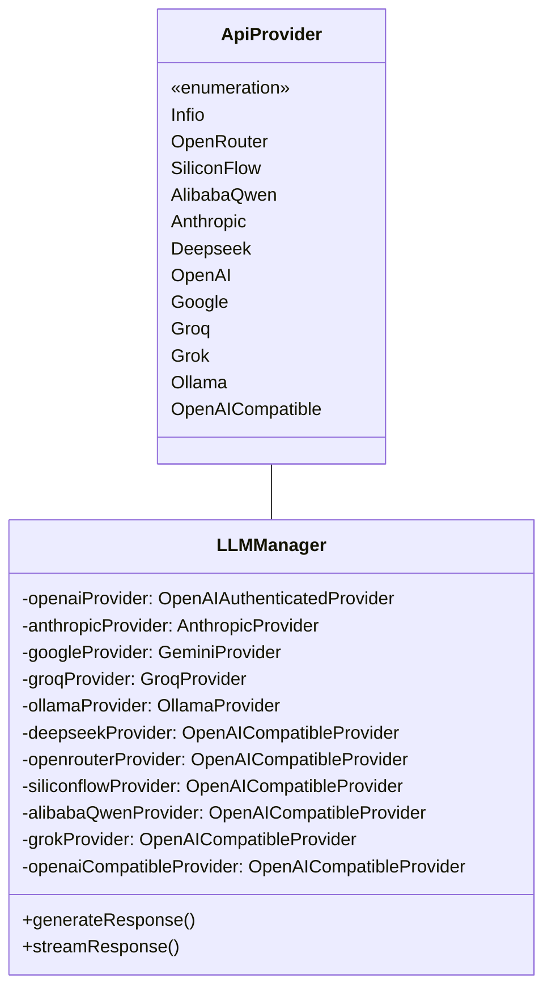
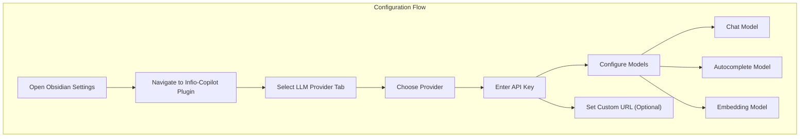
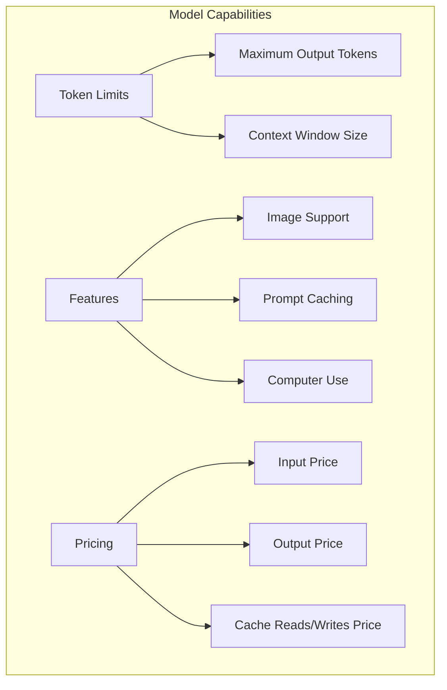
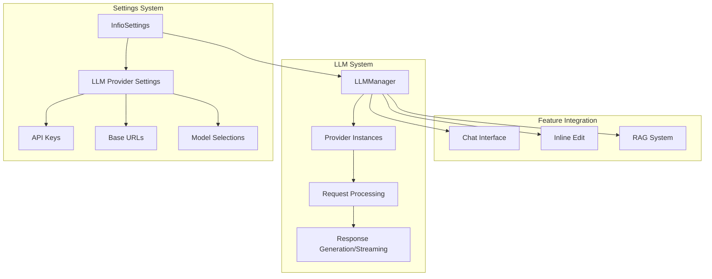
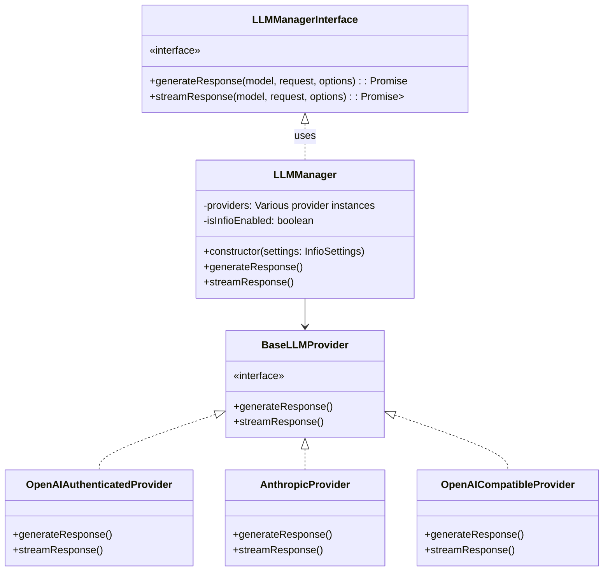

# LLM Provider Configuration

> **Relevant source files**
> * [src/constants.ts](https://github.com/infiolab/infio-copilot/blob/1b43bac6/src/constants.ts)
> * [src/core/llm/manager.ts](https://github.com/infiolab/infio-copilot/blob/1b43bac6/src/core/llm/manager.ts)
> * [src/core/llm/ollama.ts](https://github.com/infiolab/infio-copilot/blob/1b43bac6/src/core/llm/ollama.ts)
> * [src/core/llm/openai-compatible.ts](https://github.com/infiolab/infio-copilot/blob/1b43bac6/src/core/llm/openai-compatible.ts)
> * [src/core/rag/embedding.ts](https://github.com/infiolab/infio-copilot/blob/1b43bac6/src/core/rag/embedding.ts)
> * [src/settings/components/ModelProviderSettings.tsx](https://github.com/infiolab/infio-copilot/blob/1b43bac6/src/settings/components/ModelProviderSettings.tsx)
> * [src/types/llm/model.ts](https://github.com/infiolab/infio-copilot/blob/1b43bac6/src/types/llm/model.ts)
> * [src/utils/api.ts](https://github.com/infiolab/infio-copilot/blob/1b43bac6/src/utils/api.ts)

This document details how to configure various Large Language Model (LLM) providers within the Infio-Copilot plugin for Obsidian. It covers setting up API keys, selecting models, and configuring provider-specific settings. For information about configuring the RAG system, see [RAG and Search Settings](/infiolab/infio-copilot/4.2-rag-and-search-settings).

## Overview of LLM Provider System

The Infio-Copilot plugin supports multiple LLM providers, allowing users to choose their preferred provider and models for different functionalities like chat, autocomplete, and embeddings.

```mermaid
flowchart TD

Settings["Settings Interface"]
ProviderSettings["Provider Settings"]
ApiKeys["API Keys"]
BaseURLs["Base URLs"]
ModelSelection["Model Selection"]
LLMManager["LLMManager"]
Providers["Provider Implementations"]
OpenAIProvider["OpenAI Provider"]
AnthropicProvider["Anthropic Provider"]
GeminiProvider["Google/Gemini Provider"]
GroqProvider["Groq Provider"]
OllamaProvider["Ollama Provider"]
DeepseekProvider["Deepseek Provider"]
OpenRouterProvider["OpenRouter Provider"]
SiliconFlowProvider["SiliconFlow Provider"]
QwenProvider["AlibabaQwen Provider"]
GrokProvider["Grok Provider"]
CompatibleProvider["OpenAI Compatible Provider"]

    Settings --> LLMManager
subgraph LLM_Provider_System ["LLM Provider System"]
    LLMManager
    Providers
    OpenAIProvider
    AnthropicProvider
    GeminiProvider
    GroqProvider
    OllamaProvider
    DeepseekProvider
    OpenRouterProvider
    SiliconFlowProvider
    QwenProvider
    GrokProvider
    CompatibleProvider
    LLMManager --> Providers
    Providers --> OpenAIProvider
    Providers --> AnthropicProvider
    Providers --> GeminiProvider
    Providers --> GroqProvider
    Providers --> OllamaProvider
    Providers --> DeepseekProvider
    Providers --> OpenRouterProvider
    Providers --> SiliconFlowProvider
    Providers --> QwenProvider
    Providers --> GrokProvider
    Providers --> CompatibleProvider
end

subgraph LLM_Provider_Configuration ["LLM Provider Configuration"]
    Settings
    ProviderSettings
    ApiKeys
    BaseURLs
    ModelSelection
    Settings --> ProviderSettings
    ProviderSettings --> ApiKeys
    ProviderSettings --> BaseURLs
    ProviderSettings --> ModelSelection
end
```



Sources: [src/core/llm/manager.ts L36-L89](https://github.com/infiolab/infio-copilot/blob/1b43bac6/src/core/llm/manager.ts#L36-L89)

 [src/settings/components/ModelProviderSettings.tsx L49-L195](https://github.com/infiolab/infio-copilot/blob/1b43bac6/src/settings/components/ModelProviderSettings.tsx#L49-L195)

 [src/types/llm/model.ts L1-L14](https://github.com/infiolab/infio-copilot/blob/1b43bac6/src/types/llm/model.ts#L1-L14)

## Supported LLM Providers

Infio-Copilot supports a wide range of LLM providers, each with their own models, capabilities, and pricing structures.

### Available Providers



Sources: [src/types/llm/model.ts L1-L14](https://github.com/infiolab/infio-copilot/blob/1b43bac6/src/types/llm/model.ts#L1-L14)

 [src/core/llm/manager.ts L36-L49](https://github.com/infiolab/infio-copilot/blob/1b43bac6/src/core/llm/manager.ts#L36-L49)

## Configuration Interface

The LLM provider configuration is accessible through the plugin settings tab in Obsidian.

### Basic Provider Configuration

1. **Select a Provider**: Choose your preferred LLM provider from the dropdown menu
2. **API Key**: Enter your API key for the selected provider
3. **Custom Base URL** (optional): Enable and configure a custom API endpoint URL

### Model Selection

Configure different models for different features:

1. **Chat model**: For conversations in the chat interface
2. **Autocomplete model**: For inline editing and completions
3. **Embedding model**: For the RAG system and vector search



Sources: [src/settings/components/ModelProviderSettings.tsx L137-L195](https://github.com/infiolab/infio-copilot/blob/1b43bac6/src/settings/components/ModelProviderSettings.tsx#L137-L195)

## Provider-specific Settings

Each provider has specific configuration requirements. Below are the details for the major providers:

### API Keys and Base URLs

| Provider | API Key Required | Base URL | Custom URL Support |
| --- | --- | --- | --- |
| OpenAI | Yes | [https://api.openai.com/v1](https://api.openai.com/v1) | Yes |
| Anthropic | Yes | Default | No |
| Google/Gemini | Yes | Default | No |
| Groq | Yes | Default | No |
| Deepseek | Yes | [https://api.deepseek.com](https://api.deepseek.com) | Yes |
| OpenRouter | Yes | [https://openrouter.ai/api/v1](https://openrouter.ai/api/v1) | Yes |
| SiliconFlow | Yes | [https://api.siliconflow.cn/v1](https://api.siliconflow.cn/v1) | Yes |
| AlibabaQwen | Yes | [https://dashscope.aliyuncs.com/compatible-mode/v1](https://dashscope.aliyuncs.com/compatible-mode/v1) | Yes |
| Grok | Yes | [https://api.x.ai/v1](https://api.x.ai/v1) | Yes |
| Ollama | No (local) | User-defined (e.g., [http://localhost:11434](http://localhost:11434)) | Yes |
| OpenAI Compatible | Yes | User-defined | Yes |

Sources: [src/constants.ts L29-L35](https://github.com/infiolab/infio-copilot/blob/1b43bac6/src/constants.ts#L29-L35)

 [src/core/llm/manager.ts L51-L88](https://github.com/infiolab/infio-copilot/blob/1b43bac6/src/core/llm/manager.ts#L51-L88)

## Model Configuration

### Understanding Model Capabilities

When selecting models, consider their capabilities:



Sources: [src/utils/api.ts L4-L17](https://github.com/infiolab/infio-copilot/blob/1b43bac6/src/utils/api.ts#L4-L17)

### Model Information Structure

Models are defined with detailed information about their capabilities and pricing:

```yaml
interface ModelInfo {
    maxTokens?: number          // Maximum output tokens
    contextWindow?: number      // Total context window size
    supportsImages?: boolean    // Whether the model can process images
    supportsComputerUse?: boolean // Tool use capabilities
    supportsPromptCache: boolean // Context caching support
    inputPrice?: number         // Price per million input tokens (USD)
    outputPrice?: number        // Price per million output tokens (USD)
    cacheWritesPrice?: number   // Price for cache writes
    cacheReadsPrice?: number    // Price for cache reads
    description?: string        // Model description
    reasoningEffort?: string    // Low/medium/high reasoning level
    thinking?: boolean          // Thinking mode support
}
```

Sources: [src/utils/api.ts L4-L17](https://github.com/infiolab/infio-copilot/blob/1b43bac6/src/utils/api.ts#L4-L17)

## Models by Provider

Each provider offers different models with varying capabilities. Below are examples for some major providers:

### Anthropic Models

Anthropic offers Claude models with extensive context windows and various capabilities:

| Model | Context Window | Max Tokens | Image Support | Price (Input/Output) |
| --- | --- | --- | --- | --- |
| claude-3-7-sonnet-20250219 | 200,000 | 8,192 | Yes | $3.00/$15.00 |
| claude-3-5-sonnet-20241022 | 200,000 | 8,192 | Yes | $3.00/$15.00 |
| claude-3-5-haiku-20241022 | 200,000 | 8,192 | No | $1.00/$5.00 |
| claude-3-opus-20240229 | 200,000 | 4,096 | Yes | $15.00/$75.00 |

Sources: [src/utils/api.ts L100-L169](https://github.com/infiolab/infio-copilot/blob/1b43bac6/src/utils/api.ts#L100-L169)

### OpenAI Models

OpenAI provides a range of models including GPT-4o and O1 series:

| Model | Context Window | Max Tokens | Image Support | Price (Input/Output) |
| --- | --- | --- | --- | --- |
| gpt-4o | 128,000 | 16,384 | Yes | $2.50/$10.00 |
| gpt-4o-mini | 128,000 | 16,384 | Yes | $0.15/$0.60 |
| o1 | 200,000 | 100,000 | Yes | $15.00/$60.00 |
| o1-mini | 128,000 | 65,536 | Yes | $1.10/$4.40 |

Sources: [src/utils/api.ts L372-L458](https://github.com/infiolab/infio-copilot/blob/1b43bac6/src/utils/api.ts#L372-L458)

### Google/Gemini Models

Gemini offers models with very large context windows:

| Model | Context Window | Max Tokens | Image Support | Price (Input/Output) |
| --- | --- | --- | --- | --- |
| gemini-2.5-flash-preview-04-17 | 1,048,576 | 65,535 | Yes | $0.15/$0.60 |
| gemini-2.0-flash-001 | 1,048,576 | 8,192 | Yes | $0.10/$0.40 |

Sources: [src/utils/api.ts L222-L361](https://github.com/infiolab/infio-copilot/blob/1b43bac6/src/utils/api.ts#L222-L361)

## Architecture

The LLM provider configuration integrates with the rest of the system as shown below:



Sources: [src/core/llm/manager.ts L23-L205](https://github.com/infiolab/infio-copilot/blob/1b43bac6/src/core/llm/manager.ts#L23-L205)

### Provider Architecture Details

The `LLMManager` class serves as the central coordinator for all LLM interactions:



Sources: [src/core/llm/manager.ts L23-L205](https://github.com/infiolab/infio-copilot/blob/1b43bac6/src/core/llm/manager.ts#L23-L205)

 [src/core/llm/openai-compatible.ts L18-L62](https://github.com/infiolab/infio-copilot/blob/1b43bac6/src/core/llm/openai-compatible.ts#L18-L62)

## Embedding Models

Embedding models are used for the RAG system and require separate configuration:

| Provider | Available Models | Dimensions | Description |
| --- | --- | --- | --- |
| OpenAI | text-embedding-3-small | 1536 | Increased performance over ada embedding model |
| OpenAI | text-embedding-3-large | 3072 | Most capable for English and non-English tasks |
| Google | text-embedding-004 | 768 | Advanced embeddings for words, phrases, and sentences |
| SiliconFlow | BAAI/bge-m3 | 1024 | Multi-functional, multi-language, multi-granularity model |

Sources: [src/utils/api.ts L19-L22](https://github.com/infiolab/infio-copilot/blob/1b43bac6/src/utils/api.ts#L19-L22)

 [src/utils/api.ts L460-L473](https://github.com/infiolab/infio-copilot/blob/1b43bac6/src/utils/api.ts#L460-L473)

 [src/utils/api.ts L363-L368](https://github.com/infiolab/infio-copilot/blob/1b43bac6/src/utils/api.ts#L363-L368)

 [src/utils/api.ts L1212-L1233](https://github.com/infiolab/infio-copilot/blob/1b43bac6/src/utils/api.ts#L1212-L1233)

 [src/core/rag/embedding.ts L19-L221](https://github.com/infiolab/infio-copilot/blob/1b43bac6/src/core/rag/embedding.ts#L19-L221)

## Custom URL Configurations

For providers that support custom base URLs, you can configure alternative endpoints:

1. Enable "Use custom base url" in the provider settings
2. Enter the custom URL (for example, a local deployment or enterprise endpoint)

This is particularly useful for:

* Self-hosted models
* Enterprise deployments
* Regional API endpoints
* Proxies for rate limiting or cost management

Sources: [src/settings/components/ModelProviderSettings.tsx L156-L167](https://github.com/infiolab/infio-copilot/blob/1b43bac6/src/settings/components/ModelProviderSettings.tsx#L156-L167)

## Ollama Configuration

Ollama deserves special mention as it's the only provider that doesn't require an API key since it runs locally:

1. Install Ollama on your local machine
2. Start the Ollama server
3. In Infio-Copilot settings: * Select "Ollama" as provider * Enter the Ollama server URL (typically `http://localhost:11434`) * Select your locally available models

Sources: [src/core/llm/ollama.ts L49-L95](https://github.com/infiolab/infio-copilot/blob/1b43bac6/src/core/llm/ollama.ts#L49-L95)

 [src/settings/components/ModelProviderSettings.tsx L146-L154](https://github.com/infiolab/infio-copilot/blob/1b43bac6/src/settings/components/ModelProviderSettings.tsx#L146-L154)

## Troubleshooting

Common issues and their solutions:

| Issue | Possible Solution |
| --- | --- |
| "API key is missing" | Enter a valid API key in settings |
| "Base URL is missing" | Configure the base URL for the provider |
| "Rate limit exceeded" | Wait and try again, or switch to a different provider |
| "Model not found" | Ensure the selected model is available for your account |

The plugin handles these errors gracefully and provides helpful error messages in the UI.

Sources: [src/core/llm/openai-compatible.ts L40-L43](https://github.com/infiolab/infio-copilot/blob/1b43bac6/src/core/llm/openai-compatible.ts#L40-L43)

 [src/core/llm/openai-compatible.ts L54-L57](https://github.com/infiolab/infio-copilot/blob/1b43bac6/src/core/llm/openai-compatible.ts#L54-L57)

 [src/core/rag/embedding.ts L36-L39](https://github.com/infiolab/infio-copilot/blob/1b43bac6/src/core/rag/embedding.ts#L36-L39)

 [src/core/rag/embedding.ts L47-L55](https://github.com/infiolab/infio-copilot/blob/1b43bac6/src/core/rag/embedding.ts#L47-L55)