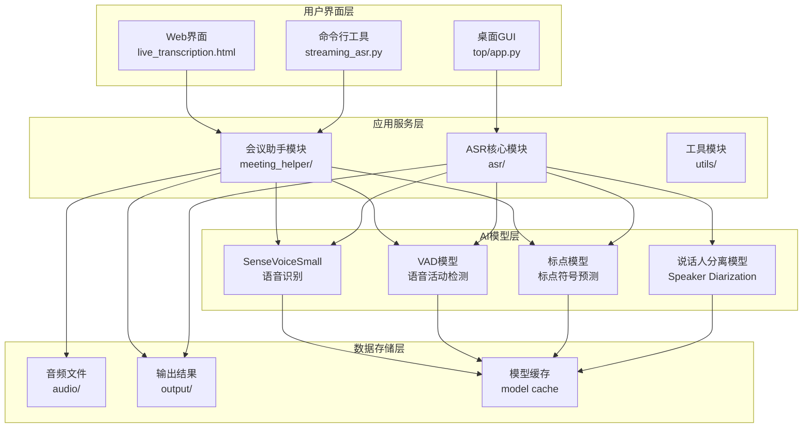
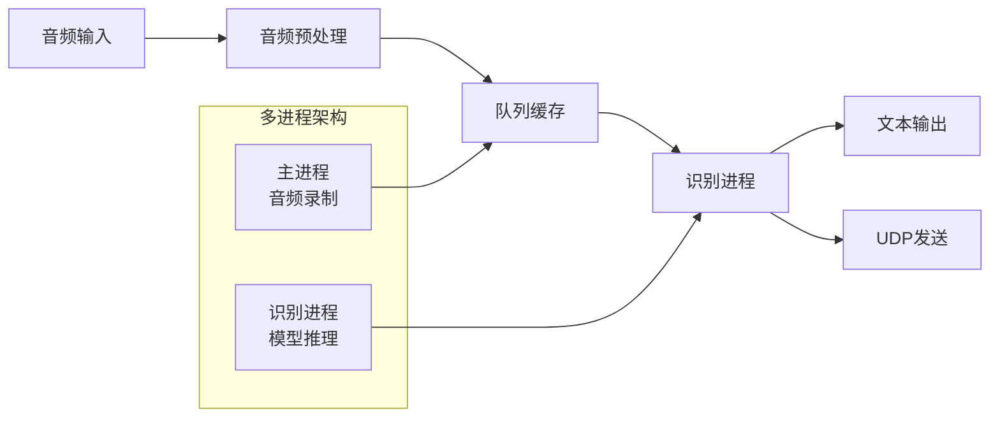
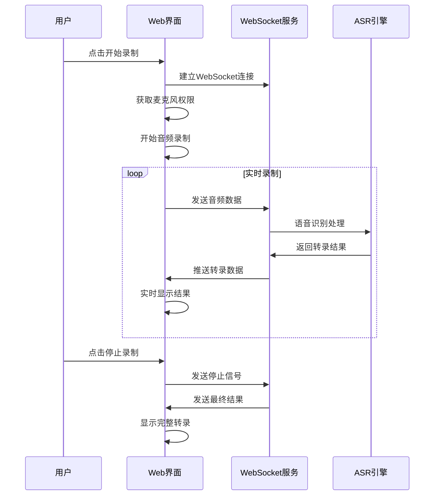
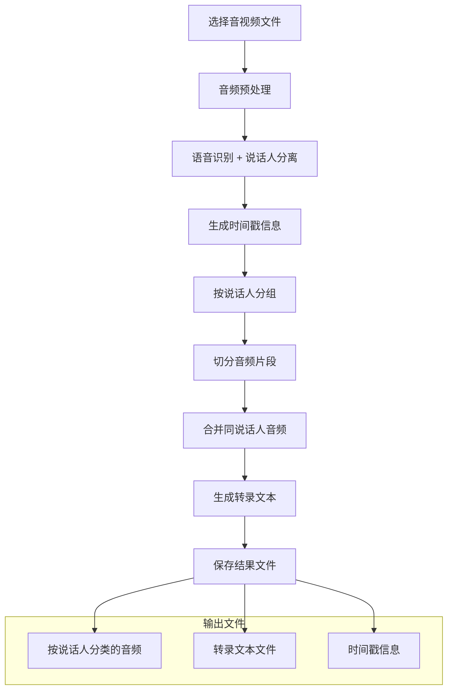
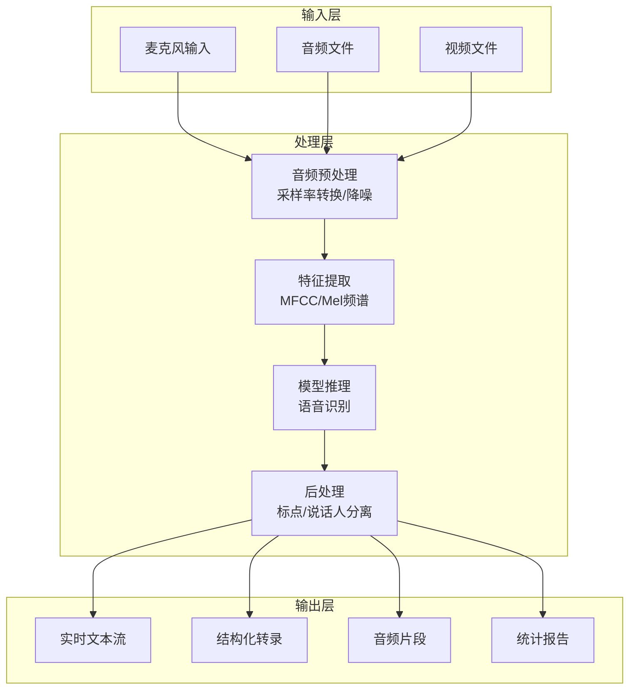
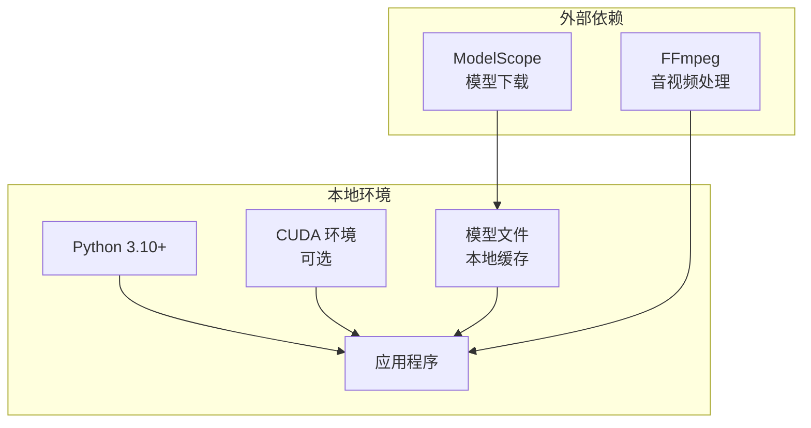
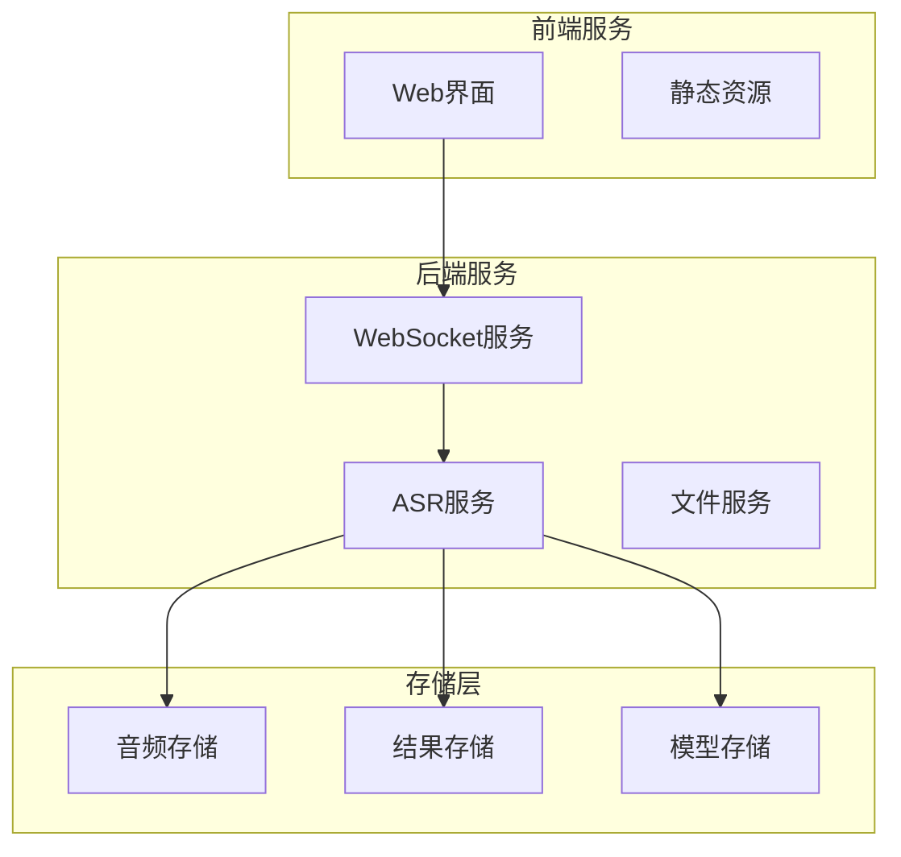

# FunASR 实时语音识别系统 - 架构概览

## 项目简介

本项目是基于 FunASR 的实时语音识别系统，支持流式转录、说话人分离、Web界面交互等功能。项目采用模块化设计，支持多种使用场景。

## 整体架构

## 核心功能模块

### 1. 流式语音识别模块 (`streaming_asr.py`)

**功能特点：**
- 实时音频录制和处理
- 基于 SenseVoiceSmall 模型的高精度语音识别
- UDP 网络通信实时发送识别结果
- 多进程架构确保实时性能

**技术架构：**

### 2. Web界面模块 (`live_transcription.html`)

**功能特点：**
- 基于 WebSocket 的实时通信
- 音频录制和波形可视化
- 实时转录结果展示
- 说话人分离和时间戳显示

**技术架构：**

### 3. 说话人分离模块 (`top/app.py`)

**功能特点：**
- 批量音视频文件处理
- 说话人自动识别和分离
- 按说话人切分音频文件
- 生成结构化转录文本

**处理流程：**

## 技术栈

### 核心依赖
- **FunASR**: 阿里达摩院开源的语音识别框架
- **SenseVoiceSmall**: 高效的多语言语音识别模型
- **sounddevice**: Python 音频录制库
- **numpy**: 数值计算库
- **ffmpeg**: 音视频处理工具

### 模型组件
- **ASR模型**: SenseVoiceSmall (多语言语音识别)
- **VAD模型**: FSMN-VAD (语音活动检测)
- **标点模型**: CT-Transformer (标点符号预测)
- **说话人模型**: CAM++ (说话人分离，可选)

## 数据流架构

## 部署架构

### 本地部署

### 分布式部署

## 性能特性

### 实时性能
- **延迟**: < 2秒 (从音频输入到文本输出)
- **吞吐量**: 支持实时音频流处理
- **并发**: 支持多路音频流同时处理

### 识别精度
- **中文识别**: > 95% 准确率
- **英文识别**: > 98% 准确率
- **说话人分离**: > 90% 准确率

### 资源消耗
- **内存**: 2-4GB (取决于模型大小)
- **GPU**: 可选，显著提升处理速度
- **存储**: 1小时音频约100MB

## 扩展性设计

### 模型扩展
- 支持多种 FunASR 模型
- 可配置模型参数
- 支持模型热切换

### 功能扩展
- 插件化架构
- API 接口标准化
- 多语言支持

### 部署扩展
- 容器化部署
- 微服务架构
- 负载均衡支持

## 下一步规划

1. **性能优化**: 模型量化、推理加速
2. **功能增强**: 情感识别、关键词提取
3. **界面改进**: 更丰富的可视化功能
4. **集成能力**: 与其他系统的API集成

---

**文档版本**: v1.0  
**创建日期**: 2024-01-15  
**维护者**: 技术团队
