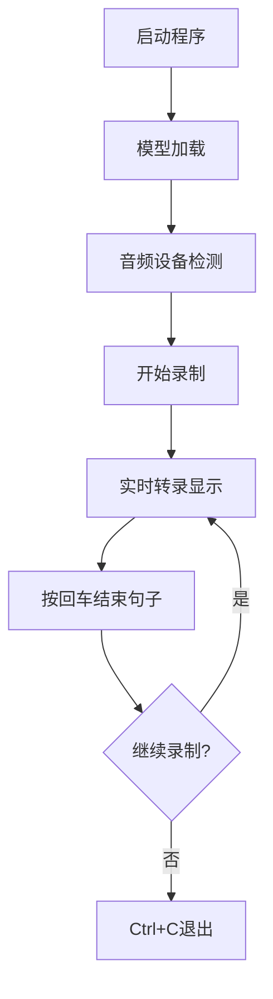
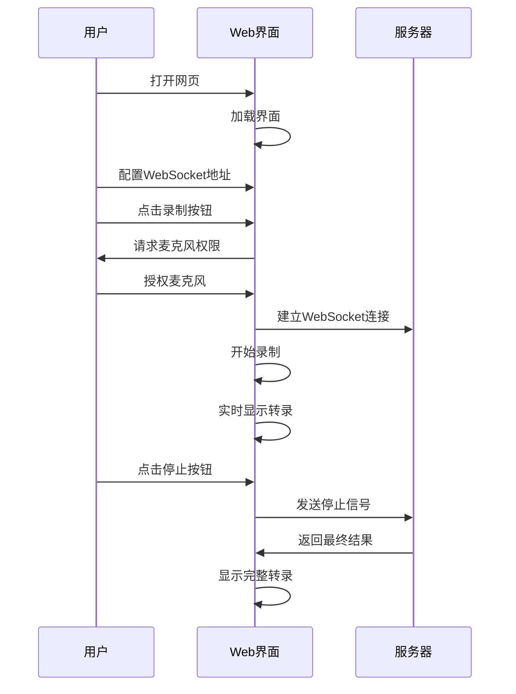
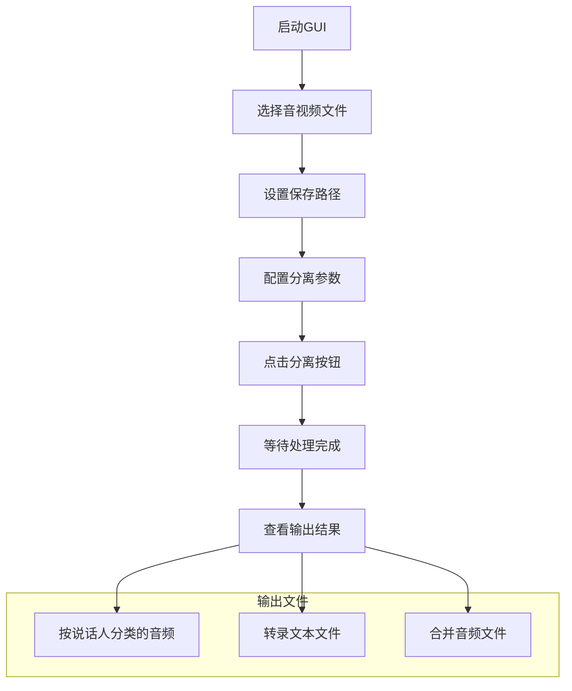

# 部署和使用指南

## 系统要求

### 硬件要求

#### 最低配置
- **CPU**: Intel i5 或 AMD Ryzen 5 以上
- **内存**: 8GB RAM
- **存储**: 20GB 可用空间
- **网络**: 稳定的互联网连接（用于模型下载）

#### 推荐配置
- **CPU**: Intel i7 或 AMD Ryzen 7 以上
- **内存**: 16GB RAM 或更多
- **GPU**: NVIDIA GTX 1060 或更高（支持CUDA）
- **存储**: 50GB 可用空间（SSD推荐）

### 软件要求

#### 操作系统
- Windows 10/11 (64位)
- macOS 10.15 或更高版本
- Ubuntu 18.04 或更高版本

#### 依赖软件
- Python 3.10 或更高版本
- FFmpeg 4.0 或更高版本
- CUDA 11.0+ (可选，用于GPU加速)

## 安装部署

### 1. 环境准备

#### Python环境安装

```bash
# 检查Python版本
python --version

# 如果版本低于3.10，请升级Python
# Windows: 从官网下载安装包
# macOS: brew install python@3.10
# Ubuntu: sudo apt update && sudo apt install python3.10
```

#### FFmpeg安装

```bash
# Windows (使用Chocolatey)
choco install ffmpeg

# macOS (使用Homebrew)
brew install ffmpeg

# Ubuntu
sudo apt update
sudo apt install ffmpeg
```

#### CUDA环境安装 (可选)

```bash
# 检查NVIDIA驱动
nvidia-smi

# 安装CUDA Toolkit (从NVIDIA官网下载)
# https://developer.nvidia.com/cuda-downloads

# 验证CUDA安装
nvcc --version
```

### 2. 项目部署

#### 克隆项目

```bash
# 克隆项目代码
git clone <项目仓库地址>
cd FunASR-Online-Paraformer-Test

# 查看项目结构
tree -L 2
```

#### 创建虚拟环境

```bash
# 创建虚拟环境
python -m venv venv

# 激活虚拟环境
# Windows
venv\Scripts\activate
# macOS/Linux
source venv/bin/activate
```

#### 安装依赖

```bash
# 安装Python依赖
pip install -r requirements.txt

# 或使用Poetry (如果有pyproject.toml)
pip install poetry
poetry install
```

### 3. 模型下载

#### 自动下载 (推荐)

```bash
# 运行模型下载脚本
python top/download_model.py

# 脚本会自动下载以下模型：
# - SenseVoiceSmall (语音识别)
# - FSMN-VAD (语音活动检测)
# - CT-Transformer (标点预测)
# - CAM++ (说话人分离)
```

#### 手动下载

```bash
# 从ModelScope下载模型
git clone https://www.modelscope.cn/FunAudioLLM/SenseVoiceSmall.git
git clone https://www.modelscope.cn/iic/speech_fsmn_vad_zh-cn-16k-common-pytorch.git
git clone https://www.modelscope.cn/iic/punc_ct-transformer_zh-cn-common-vocab272727-pytorch.git
git clone https://www.modelscope.cn/iic/speech_campplus_sv_zh-cn_16k-common.git

# 将模型文件放置到指定目录
mkdir -p D:/Cache/model/asr
# 移动模型文件到对应目录
```

### 4. 配置文件设置

#### 模型路径配置

```python
# 编辑 streaming_asr.py 中的模型路径
home_directory = "D:/Cache/model/asr"  # 修改为实际模型路径
asr_model_path = os.path.join(home_directory, "SenseVoiceSmall")
vad_model_path = os.path.join(home_directory, "speech_fsmn_vad")
punc_model_path = os.path.join(home_directory, "punc_ct-transformer")
```

#### 网络配置

```python
# UDP端口配置 (streaming_asr.py)
udp_port = 6009  # 可根据需要修改

# WebSocket配置 (live_transcription.html)
websocketUrl = "ws://localhost:8000/asr"  # 修改为实际服务器地址
```

## 使用指南

### 1. 流式语音识别

#### 启动方式

```bash
# 进入项目目录
cd src/meeting_helper

# 启动流式识别
python streaming_asr.py
```

#### 使用流程



#### 操作说明

1. **启动程序**: 运行命令后等待模型加载完成
2. **开始录制**: 看到"开始了"提示后即可说话
3. **实时显示**: 转录结果会实时显示在控制台
4. **结束句子**: 按回车键结束当前句子
5. **退出程序**: 按Ctrl+C安全退出

### 2. Web界面使用

#### 启动Web服务

```bash
# 启动WebSocket服务器 (需要额外实现)
python web_server.py

# 或直接打开HTML文件
open src/meeting_helper/live_transcription.html
```

#### 界面操作



#### 功能说明

1. **录制控制**: 点击圆形按钮开始/停止录制
2. **参数设置**: 调整音频块大小和WebSocket地址
3. **实时显示**: 转录结果实时更新，支持说话人分离
4. **波形显示**: 实时音频波形可视化
5. **状态监控**: 显示录制状态和处理进度

### 3. 说话人分离工具

#### 启动GUI应用

```bash
# 启动说话人分离工具
python top/app.py
```

#### 操作流程



#### 详细步骤

1. **文件选择**: 点击"选择音视频"按钮，支持多文件选择
2. **路径设置**: 点击"选择保存目录"设置输出路径
3. **参数配置**: 设置分离字数阈值（默认10字）
4. **开始处理**: 点击"分离"按钮开始处理
5. **进度监控**: 界面显示当前处理状态
6. **结果查看**: 处理完成后在保存目录查看结果

### 4. 批量启动脚本

#### Windows批处理

```batch
@echo off
echo 启动FunASR语音识别系统...

REM 激活虚拟环境
call venv\Scripts\activate

REM 启动流式识别
echo 启动流式语音识别...
python src\meeting_helper\streaming_asr.py

pause
```

#### Linux/macOS脚本

```bash
#!/bin/bash
echo "启动FunASR语音识别系统..."

# 激活虚拟环境
source venv/bin/activate

# 启动流式识别
echo "启动流式语音识别..."
python src/meeting_helper/streaming_asr.py
```

## 配置优化

### 1. 性能优化配置

#### GPU加速配置

```python
# 启用GPU加速
device = "cuda"  # 使用GPU
ngpu = 1         # GPU数量

# 检查GPU可用性
import torch
if torch.cuda.is_available():
    print(f"GPU可用: {torch.cuda.get_device_name(0)}")
else:
    print("GPU不可用，使用CPU")
    device = "cpu"
```

#### 内存优化配置

```python
# 批处理大小调整
batch_size_s = 300  # 根据内存大小调整

# 音频缓存配置
chunk_size = [10, 20, 10]  # 可根据延迟要求调整
```

### 2. 网络配置优化

#### UDP配置

```python
# UDP缓冲区大小
socket.setsockopt(socket.SOL_SOCKET, socket.SO_SNDBUF, 65536)

# 超时设置
socket.settimeout(5.0)
```

#### WebSocket配置

```javascript
// 连接超时设置
const websocket = new WebSocket(url);
websocket.timeout = 10000;

// 重连机制
function reconnectWebSocket() {
    setTimeout(() => {
        setupWebSocket();
    }, 3000);
}
```

## 故障排除

### 1. 常见问题

#### 模型加载失败

```bash
# 问题: 模型路径不存在
# 解决: 检查模型路径配置
ls -la D:/Cache/model/asr/

# 问题: 模型文件损坏
# 解决: 重新下载模型
python top/download_model.py
```

#### 音频设备问题

```bash
# 问题: 找不到麦克风设备
# 解决: 检查音频设备
python -c "import sounddevice as sd; print(sd.query_devices())"

# 问题: 权限不足
# 解决: 检查麦克风权限设置
```

#### 内存不足

```python
# 问题: 内存溢出
# 解决: 调整批处理大小
batch_size_s = 150  # 减小批处理大小

# 或使用CPU模式
device = "cpu"
ngpu = 0
```

### 2. 日志调试

#### 启用详细日志

```python
# 启用模型日志
model = AutoModel(
    # ... 其他参数
    disable_log=False,    # 启用日志
    disable_pbar=False,   # 启用进度条
)

# 添加调试信息
import logging
logging.basicConfig(level=logging.DEBUG)
```

#### 性能监控

```python
import time
import psutil

def monitor_performance():
    """监控系统性能"""
    cpu_percent = psutil.cpu_percent(interval=1)
    memory = psutil.virtual_memory()
    
    print(f"CPU使用率: {cpu_percent}%")
    print(f"内存使用率: {memory.percent}%")
    print(f"可用内存: {memory.available / 1024**3:.2f}GB")
```

## 生产环境部署

### 1. Docker部署

```dockerfile
FROM python:3.10-slim

# 安装系统依赖
RUN apt-get update && apt-get install -y \
    ffmpeg \
    git \
    && rm -rf /var/lib/apt/lists/*

# 设置工作目录
WORKDIR /app

# 复制项目文件
COPY . .

# 安装Python依赖
RUN pip install -r requirements.txt

# 下载模型
RUN python top/download_model.py

# 暴露端口
EXPOSE 8000 6009

# 启动命令
CMD ["python", "src/meeting_helper/streaming_asr.py"]
```

### 2. 服务化部署

```bash
# 创建systemd服务文件
sudo tee /etc/systemd/system/funasr.service > /dev/null <<EOF
[Unit]
Description=FunASR Speech Recognition Service
After=network.target

[Service]
Type=simple
User=funasr
WorkingDirectory=/opt/funasr
ExecStart=/opt/funasr/venv/bin/python src/meeting_helper/streaming_asr.py
Restart=always
RestartSec=10

[Install]
WantedBy=multi-user.target
EOF

# 启用并启动服务
sudo systemctl enable funasr
sudo systemctl start funasr
sudo systemctl status funasr
```

### 3. 负载均衡配置

```nginx
# Nginx配置示例
upstream funasr_backend {
    server 127.0.0.1:8000;
    server 127.0.0.1:8001;
    server 127.0.0.1:8002;
}

server {
    listen 80;
    server_name funasr.example.com;
    
    location /asr {
        proxy_pass http://funasr_backend;
        proxy_http_version 1.1;
        proxy_set_header Upgrade $http_upgrade;
        proxy_set_header Connection "upgrade";
        proxy_set_header Host $host;
        proxy_set_header X-Real-IP $remote_addr;
    }
}
```

---

**文档版本**: v1.0  
**创建日期**: 2024-01-15  
**维护者**: 技术团队
