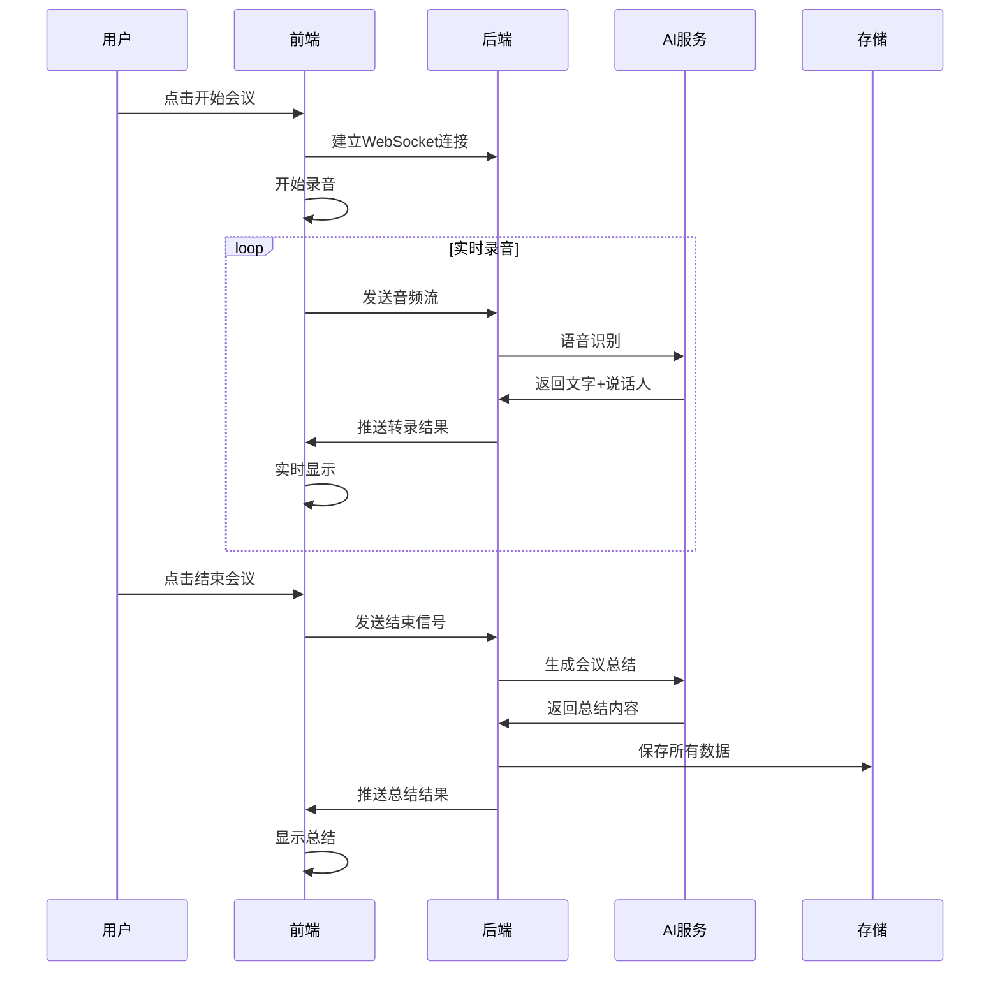

# 智能会议助手产品需求文档 (PRD)

## 1. 产品概述

### 1.1 产品定位
智能会议助手是一款基于实时语音识别技术的会议记录和总结工具，旨在提高会议效率，减少人工记录负担，为用户提供智能化的会议管理体验。

### 1.2 目标用户
- **主要用户**：企业管理者、项目经理、会议组织者
- **次要用户**：参会人员、行政助理、培训师
- **用户规模**：中小企业团队（5-50人）

### 1.3 核心价值
- 🎯 **效率提升**：自动记录会议内容，节省90%的会议记录时间
- 🧠 **智能总结**：AI驱动的会议要点提取和行动项识别
- 👥 **多人识别**：准确区分不同说话人，保持发言脉络清晰
- 📊 **数据沉淀**：会议内容结构化存储，便于后续检索和分析

## 2. 功能需求

### 2.1 核心功能模块

#### 2.1.1 实时会议记录
**功能描述**：实时录音转文字，支持多说话人识别

**详细需求**：
- ✅ 一键开始/结束会议录制
- ✅ 实时语音转文字显示（延迟<2秒）
- ✅ 自动说话人分离和标记
- ✅ 支持中英文混合识别
- ✅ 实时时间戳记录（精确到秒）
- ✅ 音频质量监控和异常提醒
- ✅ 支持暂停/恢复录制

**优先级**：P0（核心功能）

#### 2.1.2 智能会议总结
**功能描述**：基于AI的会议内容分析和总结生成

**详细需求**：
- ✅ 自动提取会议关键信息
- ✅ 生成会议摘要（200-500字）
- ✅ 识别和提取行动项（Action Items）
- ✅ 提取重要决策和结论
- ✅ 生成参会人员发言统计
- ✅ 支持自定义总结模板
- ✅ 总结内容可编辑和导出

**优先级**：P0（核心功能）

#### 2.1.3 会议数据管理
**功能描述**：会议文件的存储、管理和检索

**详细需求**：
- ✅ 自动保存原始音频文件（WAV格式）
- ✅ 保存完整转录文本（支持多种格式）
- ✅ 保存会议总结报告
- ✅ 按时间/主题/参与人分类管理
- ✅ 支持会议内容全文搜索
- ✅ 支持批量导出功能
- ✅ 数据备份和恢复机制

**优先级**：P1（重要功能）

### 2.2 增值功能模块

#### 2.2.1 会议分析洞察
**功能描述**：基于历史会议数据的分析和洞察

**详细需求**：
- 📊 会议时长和频次统计
- 📊 参与人员活跃度分析
- 📊 会议效率评估指标
- 📊 热门话题和关键词云
- 📊 行动项完成率跟踪

**优先级**：P2（增值功能）

#### 2.2.2 协作功能
**功能描述**：支持团队协作的扩展功能

**详细需求**：
- 👥 会议邀请和提醒
- 👥 会议纪要分享和评论
- 👥 行动项分配和跟进
- 👥 会议模板库管理

**优先级**：P2（增值功能）

## 3. 技术架构

### 3.1 整体架构
```
┌─────────────────┐    WebSocket    ┌─────────────────┐
│   前端 (Web)    │ ◄──────────────► │  后端 (FastAPI) │
│                 │                 │                 │
│ - Vue 3 + TS    │                 │ - FastAPI       │
│ - Element Plus  │                 │ - WebSocket     │
│ - WebRTC        │                 │ - FunASR        │
│ - Apple UI 风格 │                 │ - SQLite/MySQL  │
└─────────────────┘                 └─────────────────┘
                                             │
                                             ▼
                                    ┌─────────────────┐
                                    │   AI 服务层     │
                                    │                 │
                                    │ - 语音识别      │
                                    │ - 说话人分离    │
                                    │ - 内容总结      │
                                    │ - 关键词提取    │
                                    └─────────────────┘
```

### 3.2 前端技术栈
- **框架**：Vue 3 + TypeScript
- **UI库**：Element Plus（定制Apple风格主题）
- **音频处理**：WebRTC API
- **实时通信**：WebSocket
- **状态管理**：Pinia
- **构建工具**：Vite

### 3.3 后端技术栈
- **Web框架**：FastAPI
- **实时通信**：WebSocket
- **语音识别**：FunASR (SenseVoiceSmall)
- **数据库**：SQLite（开发）/ MySQL（生产）
- **AI服务**：集成大语言模型API
- **文件存储**：本地文件系统

### 3.4 数据流设计


## 4. 用户体验设计

### 4.1 设计原则
- **简约至上**：Apple风格的简洁界面，减少认知负担
- **实时反馈**：所有操作都有即时的视觉反馈
- **容错设计**：网络异常、音频问题等场景的优雅降级
- **无障碍访问**：支持键盘导航和屏幕阅读器

### 4.2 核心页面设计

#### 4.2.1 会议主界面
```
┌─────────────────────────────────────────────────────────┐
│  🎙️ 智能会议助手                    [设置] [历史记录]  │
├─────────────────────────────────────────────────────────┤
│                                                         │
│  ┌─────────────────────────────────────────────────┐   │
│  │  📊 会议状态                                    │   │
│  │  ⏱️  录制时长: 00:15:32                        │   │
│  │  👥 参与人数: 3人                              │   │
│  │  🎵 音频质量: 良好                             │   │
│  └─────────────────────────────────────────────────┘   │
│                                                         │
│  ┌─────────────────────────────────────────────────┐   │
│  │  💬 实时转录                                    │   │
│  │                                                 │   │
│  │  [14:30:15] 张三: 今天我们讨论一下项目进度...   │   │
│  │  [14:30:45] 李四: 我觉得我们需要调整时间安排... │   │
│  │  [14:31:02] 王五: 同意，建议延期一周...         │   │
│  │                                                 │   │
│  └─────────────────────────────────────────────────┘   │
│                                                         │
│  ┌─────────────┐  ┌─────────────┐  ┌─────────────┐     │
│  │  🔴 开始会议 │  │  ⏸️ 暂停    │  │  ⏹️ 结束会议 │     │
│  └─────────────┘  └─────────────┘  └─────────────┘     │
└─────────────────────────────────────────────────────────┘
```

#### 4.2.2 会议总结界面
```
┌─────────────────────────────────────────────────────────┐
│  📋 会议总结                                [编辑] [导出] │
├─────────────────────────────────────────────────────────┤
│                                                         │
│  📅 会议时间: 2024-01-15 14:30-15:15                   │
│  ⏱️ 会议时长: 45分钟                                    │
│  👥 参与人员: 张三、李四、王五                          │
│                                                         │
│  📝 会议摘要:                                           │
│  本次会议主要讨论了项目进度调整事宜，经过充分讨论，     │
│  决定将项目交付时间延期一周，以确保质量...             │
│                                                         │
│  ✅ 行动项:                                             │
│  1. 张三负责更新项目计划 (截止: 1月20日)               │
│  2. 李四协调资源调配 (截止: 1月18日)                   │
│  3. 王五准备风险评估报告 (截止: 1月22日)               │
│                                                         │
│  🎯 重要决策:                                           │
│  • 项目延期一周                                        │
│  • 增加质量检查环节                                    │
│                                                         │
└─────────────────────────────────────────────────────────┘
```

### 4.3 交互设计要点
- **一键操作**：开始/结束会议只需一次点击
- **状态指示**：清晰的录制状态、网络状态、音频状态指示
- **实时预览**：转录内容实时滚动显示，支持手动滚动
- **智能提醒**：音频异常、网络断开等情况的友好提示

## 5. 数据模型设计

### 5.1 核心数据表

#### 5.1.1 会议表 (meetings)
```sql
CREATE TABLE meetings (
    id INTEGER PRIMARY KEY AUTOINCREMENT,
    title VARCHAR(200) NOT NULL,
    start_time DATETIME NOT NULL,
    end_time DATETIME,
    duration INTEGER, -- 秒
    status ENUM('recording', 'processing', 'completed') DEFAULT 'recording',
    audio_file_path VARCHAR(500),
    transcript_file_path VARCHAR(500),
    summary_content TEXT,
    participant_count INTEGER DEFAULT 0,
    created_at DATETIME DEFAULT CURRENT_TIMESTAMP,
    updated_at DATETIME DEFAULT CURRENT_TIMESTAMP
);
```

#### 5.1.2 转录记录表 (transcripts)
```sql
CREATE TABLE transcripts (
    id INTEGER PRIMARY KEY AUTOINCREMENT,
    meeting_id INTEGER NOT NULL,
    speaker_id VARCHAR(50),
    speaker_name VARCHAR(100),
    content TEXT NOT NULL,
    start_time DECIMAL(10,3), -- 相对会议开始的秒数
    end_time DECIMAL(10,3),
    confidence DECIMAL(3,2), -- 识别置信度
    created_at DATETIME DEFAULT CURRENT_TIMESTAMP,
    FOREIGN KEY (meeting_id) REFERENCES meetings(id)
);
```

#### 5.1.3 行动项表 (action_items)
```sql
CREATE TABLE action_items (
    id INTEGER PRIMARY KEY AUTOINCREMENT,
    meeting_id INTEGER NOT NULL,
    content TEXT NOT NULL,
    assignee VARCHAR(100),
    due_date DATE,
    status ENUM('pending', 'in_progress', 'completed') DEFAULT 'pending',
    created_at DATETIME DEFAULT CURRENT_TIMESTAMP,
    FOREIGN KEY (meeting_id) REFERENCES meetings(id)
);
```

### 5.2 文件存储结构
```
output/meeting/
├── 2024/
│   ├── 01/
│   │   ├── 15/
│   │   │   ├── meeting_20240115_143000/
│   │   │   │   ├── audio.wav          # 原始音频
│   │   │   │   ├── transcript.txt     # 完整转录
│   │   │   │   ├── transcript.json    # 结构化转录
│   │   │   │   ├── summary.md         # 会议总结
│   │   │   │   └── metadata.json      # 元数据
```

## 6. 性能指标

### 6.1 功能性能指标
- **识别准确率**：中文 ≥ 95%，英文 ≥ 98%
- **实时性**：语音转文字延迟 < 2秒
- **说话人识别准确率**：≥ 90%
- **总结生成时间**：< 30秒（1小时会议）

### 6.2 系统性能指标
- **并发支持**：同时支持10个会议录制
- **音频质量**：支持16kHz采样率
- **存储效率**：1小时会议约占用100MB空间
- **网络要求**：最低1Mbps上行带宽

### 6.3 用户体验指标
- **页面加载时间**：< 3秒
- **操作响应时间**：< 500ms
- **系统可用性**：≥ 99.5%

## 7. 开发计划

### 7.1 开发阶段

#### Phase 1: 核心功能开发 (4周)
- Week 1-2: 后端API和WebSocket服务
- Week 3-4: 前端基础界面和实时录制

#### Phase 2: AI功能集成 (3周)
- Week 5-6: 语音识别和说话人分离
- Week 7: 智能总结功能

#### Phase 3: 完善和优化 (3周)
- Week 8: 数据管理和存储
- Week 9: 用户体验优化
- Week 10: 测试和部署

### 7.2 里程碑
- **M1**: 基础录制和转录功能完成
- **M2**: 智能总结功能完成
- **M3**: 完整产品发布

## 8. 风险评估

### 8.1 技术风险
- **语音识别准确率**：不同环境下的识别效果差异
  - *缓解措施*：多模型备选，环境适配优化
- **实时性能**：高并发下的系统稳定性
  - *缓解措施*：负载测试，性能监控

### 8.2 产品风险
- **用户接受度**：新技术的学习成本
  - *缓解措施*：简化操作流程，提供详细引导
- **数据隐私**：会议内容的安全性
  - *缓解措施*：本地部署选项，数据加密

## 9. 成功指标

### 9.1 产品指标
- **用户留存率**：30天留存 > 60%
- **功能使用率**：核心功能使用率 > 80%
- **用户满意度**：NPS > 50

### 9.2 业务指标
- **会议效率提升**：记录时间节省 > 80%
- **用户反馈**：功能完整度评分 > 4.0/5.0
- **技术指标达成率**：> 95%

---

**文档版本**: v1.0  
**创建日期**: 2024-01-15  
**最后更新**: 2024-01-15  
**负责人**: 产品经理  
**审核人**: 技术负责人