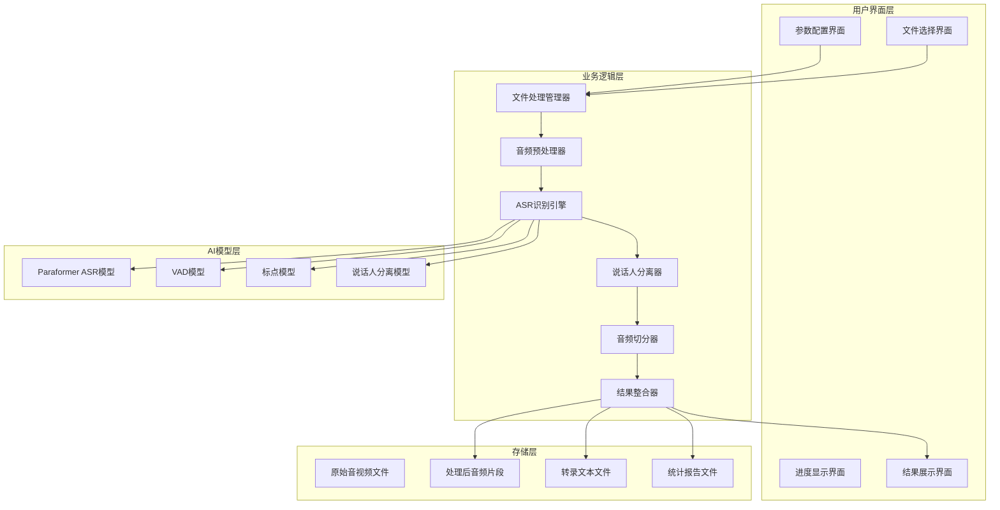
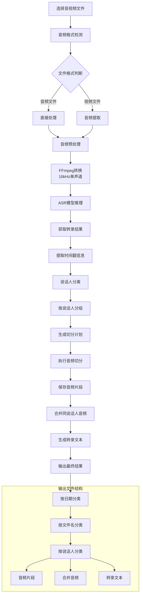
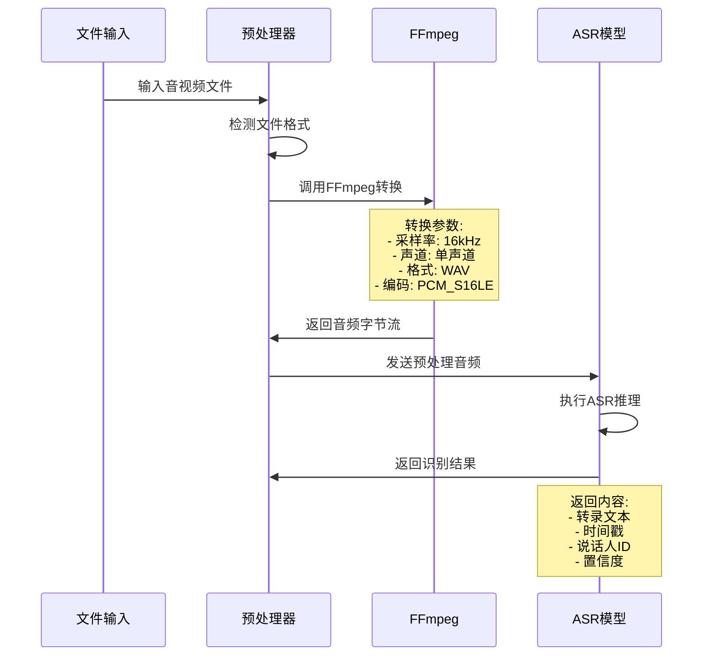
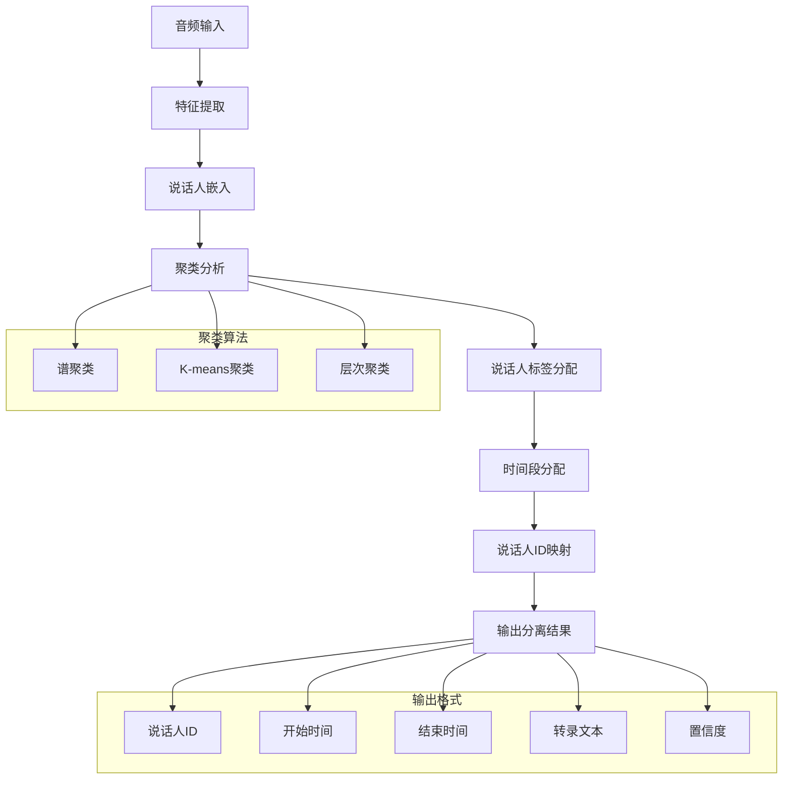
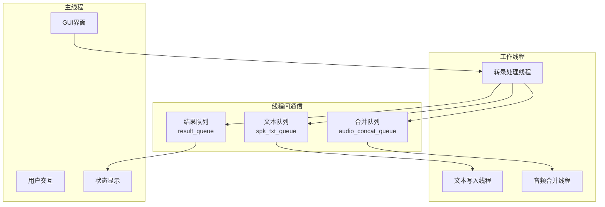
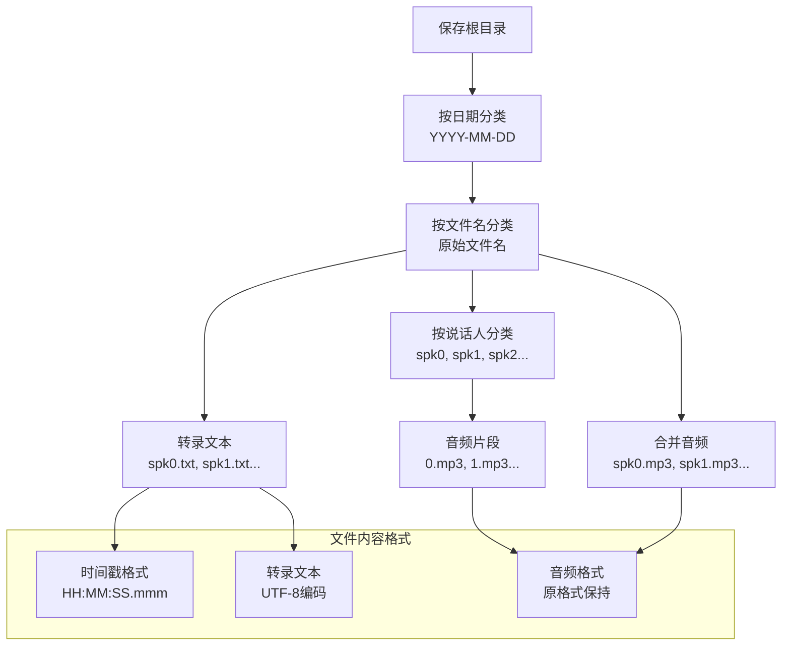
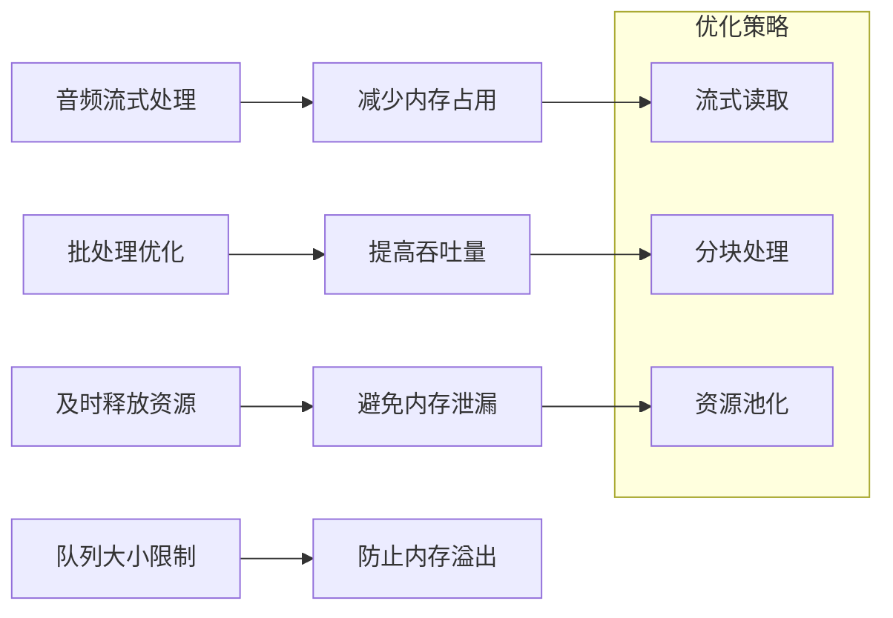

# 说话人分离技术文档

## 概述

说话人分离模块 (`top/app.py`) 是一个基于GUI的批量音视频处理工具，实现了自动说话人识别、音频分离、转录文本生成等功能。该模块使用完整的FunASR模型套件，支持高精度的说话人分离和音频切分。

## 技术架构

### 整体架构图



### 核心处理流程



## 核心功能模块

### 1. 模型初始化

```python
# 完整的ASR模型配置
model = AutoModel(
    model=asr_model_path,           # Paraformer主模型
    model_revision=asr_model_revision,
    vad_model=vad_model_path,       # 语音活动检测
    vad_model_revision=vad_model_revision,
    punc_model=punc_model_path,     # 标点符号预测
    punc_model_revision=punc_model_revision,
    spk_model=spk_model_path,       # 说话人分离模型
    spk_model_revision=spk_model_revision,
    ngpu=ngpu,                      # GPU配置
    ncpu=ncpu,                      # CPU配置
    device=device,                  # 计算设备
    disable_pbar=True,              # 禁用进度条
    disable_log=True,               # 禁用日志
    disable_update=True             # 禁用更新
)
```

### 2. 音频预处理流程



### 3. 说话人分离算法



## 关键代码解析

### 1. 音频预处理实现

```python
def trans():
    """主要转录处理函数"""
    for audio in selected_file_list:
        if os.path.exists(audio):
            audio_name = os.path.splitext(os.path.basename(audio))[0]
            
            # 使用FFmpeg进行音频预处理
            try:
                audio_bytes, _ = (
                    ffmpeg.input(audio, threads=0, hwaccel='cuda')
                    .output("-", format="wav", acodec="pcm_s16le", ac=1, ar=16000)
                    .run(cmd=["ffmpeg", "-nostdin"], 
                         capture_stdout=True, capture_stderr=True)
                )
                
                # 调用ASR模型进行推理
                res = model.generate(
                    input=audio_bytes, 
                    batch_size_s=300,      # 批处理大小
                    is_final=True,         # 最终结果
                    sentence_timestamp=True # 句子级时间戳
                )
                
                rec_result = res[0]
                process_result(rec_result, audio_name)
                
            except Exception as e:
                print(f"处理异常: {e}")
```

### 2. 说话人分组和音频切分

```python
def process_result(rec_result, audio_name):
    """处理识别结果并进行音频切分"""
    sentences = []
    
    # 处理句子信息，按说话人分组
    for sentence in rec_result["sentence_info"]:
        start = to_date(sentence["start"])  # 转换时间格式
        end = to_date(sentence["end"])
        spk_id = sentence["spk"]            # 说话人ID
        text = sentence["text"]             # 转录文本
        
        # 合并相同说话人的连续句子
        if (sentences and 
            sentence["spk"] == sentences[-1]["spk"] and 
            len(sentences[-1]["text"]) < int(split_number.get())):
            sentences[-1]["text"] += "" + sentence["text"]
            sentences[-1]["end"] = end
        else:
            sentences.append({
                "text": text, 
                "start": start, 
                "end": end, 
                "spk": spk_id
            })
    
    # 执行音频切分
    cut_audio_segments(sentences, audio_name)
```

### 3. 音频切分和文件保存

```python
def cut_audio_segments(sentences, audio_name):
    """根据时间戳切分音频"""
    speaker_audios = {}  # 存储每个说话人的音频片段
    
    for i, stn in enumerate(sentences):
        start = stn['start']
        end = stn['end']
        spk = stn['spk']
        text = stn['text']
        
        # 创建保存目录结构
        date = datetime.now().strftime("%Y-%m-%d")
        final_save_path = os.path.join(save_path.get(), date, audio_name, str(spk))
        os.makedirs(final_save_path, exist_ok=True)
        
        # 确定输出文件格式
        file_ext = os.path.splitext(audio)[-1]
        final_save_file = os.path.join(final_save_path, str(i) + file_ext)
        
        try:
            if file_ext in support_audio_format:
                # 音频文件切分
                (
                    ffmpeg.input(audio, threads=0, ss=start, to=end, hwaccel='cuda')
                    .output(final_save_file)
                    .run(cmd=["ffmpeg", "-nostdin"], 
                         overwrite_output=True, 
                         capture_stdout=True, capture_stderr=True)
                )
            elif file_ext in support_video_format:
                # 视频文件切分（转换为MP4）
                final_save_file = os.path.join(final_save_path, str(i) + '.mp4')
                (
                    ffmpeg.input(audio, threads=0, ss=start, to=end, hwaccel='cuda')
                    .output(final_save_file, vcodec='libx264', crf=23, acodec='aac', ab='128k')
                    .run(cmd=["ffmpeg", "-nostdin"], 
                         overwrite_output=True, 
                         capture_stdout=True, capture_stderr=True)
                )
        except ffmpeg.Error as e:
            print(f"音频切分错误: {e}")
        
        # 记录说话人音频片段用于后续合并
        if spk not in speaker_audios:
            speaker_audios[spk] = []
        speaker_audios[spk].append({
            'file': final_save_file, 
            'audio_name': audio_name
        })
    
    # 将结果放入合并队列
    audio_concat_queue.put(speaker_audios)
```

## 多线程架构

### 1. 线程管理架构



### 2. 队列通信机制

```python
# 创建线程间通信队列
result_queue = queue.Queue()        # 结果状态队列
spk_txt_queue = queue.Queue()       # 文本写入队列
audio_concat_queue = queue.Queue()  # 音频合并队列

# 转录处理线程
def start_transcription_thread():
    thread = threading.Thread(target=trans)
    thread.start()

# 文本写入线程
def write_txt():
    while True:
        item = spk_txt_queue.get()
        spk_txt_file = item['spk_txt_file']
        spk_txt = item['spk_txt']
        spk_start = item['start']
        spk_end = item['end']
        
        # 写入转录文本
        with open(spk_txt_file, 'a', encoding='utf-8') as f:
            f.write(f"{spk_start} --> {spk_end}\n{spk_txt}\n\n")

# 音频合并线程
def audio_concat_worker():
    while True:
        speaker_audios = audio_concat_queue.get()
        for spk, audio_segments in speaker_audios.items():
            # 合并同一说话人的所有音频片段
            merge_speaker_audio(spk, audio_segments)
```

## 文件输出结构

### 1. 目录结构设计



### 2. 输出文件示例

```
output/
├── 2024-01-15/
│   ├── meeting_recording/
│   │   ├── spk0/
│   │   │   ├── 0.mp3          # 说话人0的第1个片段
│   │   │   ├── 1.mp3          # 说话人0的第2个片段
│   │   │   └── ...
│   │   ├── spk1/
│   │   │   ├── 0.mp3          # 说话人1的第1个片段
│   │   │   └── ...
│   │   ├── spk0.mp3           # 说话人0的合并音频
│   │   ├── spk1.mp3           # 说话人1的合并音频
│   │   ├── spk0.txt           # 说话人0的转录文本
│   │   └── spk1.txt           # 说话人1的转录文本
```

### 3. 转录文本格式

```
00:01:23.456 --> 00:01:28.789
大家好，今天我们来讨论项目进度。

00:01:30.123 --> 00:01:35.456
我认为我们需要调整一下时间安排。

00:01:37.789 --> 00:01:42.123
同意，建议将截止日期延后一周。
```

## 性能优化

### 1. 批处理优化

```python
# 批处理配置
batch_size_s = 300  # 批处理时长（秒）

# 使用批处理提高效率
res = model.generate(
    input=audio_bytes, 
    batch_size_s=batch_size_s,
    is_final=True,
    sentence_timestamp=True
)
```

### 2. 硬件加速

```python
# GPU加速配置
ngpu = 1
device = "cuda"
ncpu = 4

# FFmpeg硬件加速
ffmpeg.input(audio, threads=0, hwaccel='cuda')
```

### 3. 内存管理



## 错误处理和异常恢复

### 1. 异常处理策略

```python
try:
    # 音频处理
    audio_bytes, _ = ffmpeg_process()
    res = model.generate(input=audio_bytes, ...)
    
except ffmpeg.Error as e:
    print(f"FFmpeg处理错误: {e}")
    # 跳过当前文件，继续处理下一个
    
except Exception as e:
    print(f"模型推理错误: {e}")
    # 记录错误日志，尝试降级处理
    
finally:
    # 清理临时资源
    cleanup_temp_files()
```

### 2. 文件格式兼容性

```python
# 支持的文件格式
support_audio_format = ['.mp3', '.m4a', '.aac', '.ogg', '.wav', '.flac', '.wma', '.aif']
support_video_format = ['.mp4', '.avi', '.mov', '.mkv']

def check_file_format(file_path):
    """检查文件格式兼容性"""
    _, ext = os.path.splitext(file_path)
    ext = ext.lower()
    
    if ext in support_audio_format:
        return 'audio'
    elif ext in support_video_format:
        return 'video'
    else:
        raise ValueError(f"不支持的文件格式: {ext}")
```

---

**文档版本**: v1.0  
**创建日期**: 2024-01-15  
**维护者**: 技术团队
