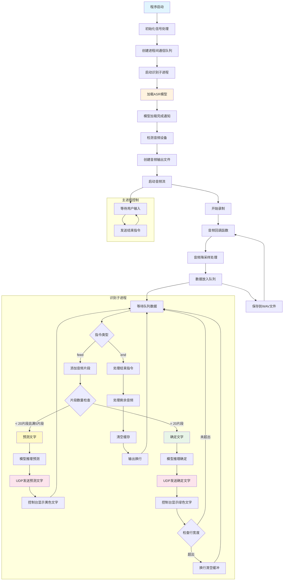

# 实时语音识别系统分析

## 主要功能

这个代码实现了一个基于FunASR的实时语音识别系统，主要功能包括：

1. **实时音频录制**：使用sounddevice库从麦克风录制音频
2. **流式语音识别**：使用SenseVoiceSmall模型进行实时语音转文字
3. **多进程架构**：主进程负责音频录制，子进程负责语音识别
4. **实时文字输出**：
   - 控制台彩色显示（绿色为确定文字，黄色为预测文字）
   - UDP网络发送（端口6009）
   - 音频文件保存
5. **智能预测**：在音频片段不足时提供预测文字
6. **自动换行**：根据设定宽度自动换行显示

## 核心技术特点

- **音频处理**：48kHz采样率录制，降采样到16kHz用于识别
- **分块处理**：每60ms一个片段，使用滑动窗口机制
- **缓存机制**：维护识别状态缓存，提高连续识别准确性
- **双重输出**：实时预测文字和确定文字分别显示

## 执行流程图

## 关键组件说明

### 1. 音频处理流程
- **采样率转换**：48kHz → 16kHz
- **声道处理**：多声道 → 单声道
- **数据格式**：float32 → int16（保存时）

### 2. 识别策略
- **滑动窗口**：[10, 20, 10] - 左回看10片段，总长20片段，右回看10片段
- **预测机制**：每5个片段进行一次预测
- **确定机制**：达到20个片段时进行确定识别

### 3. 输出机制
- **控制台**：使用ANSI转义序列实现彩色显示和光标控制
- **网络**：UDP协议发送到本地6009端口
- **文件**：保存原始录音到audio/out.wav

### 4. 进程通信
- **队列通信**：主进程与识别进程通过Queue交换数据
- **指令类型**：
  - `feed`：音频数据
  - `end`：结束当前语句

## 配置参数

- **UDP端口**：6009
- **行宽限制**：50字符
- **音频块大小**：3 * 960 samples (0.06秒)
- **预测触发**：5个片段
- **确定触发**：20个片段