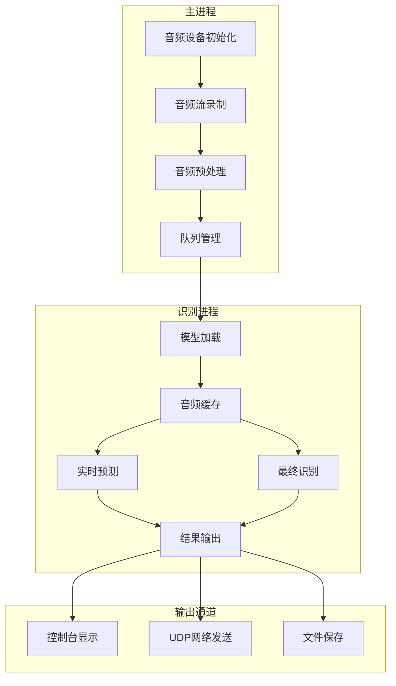
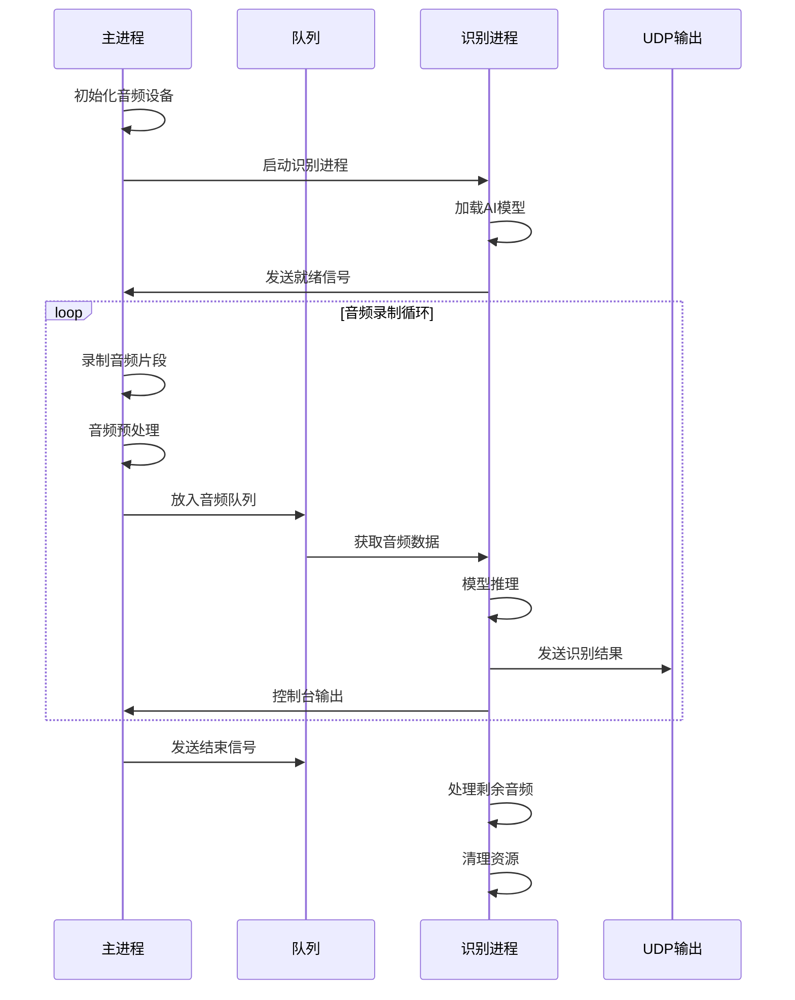
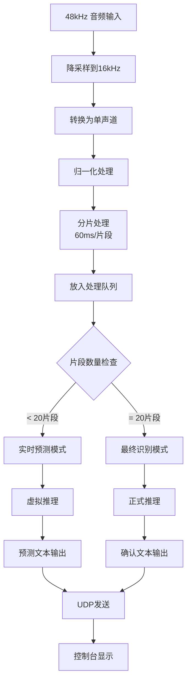
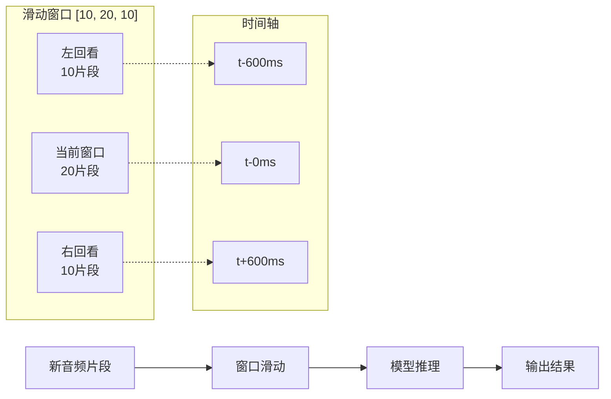
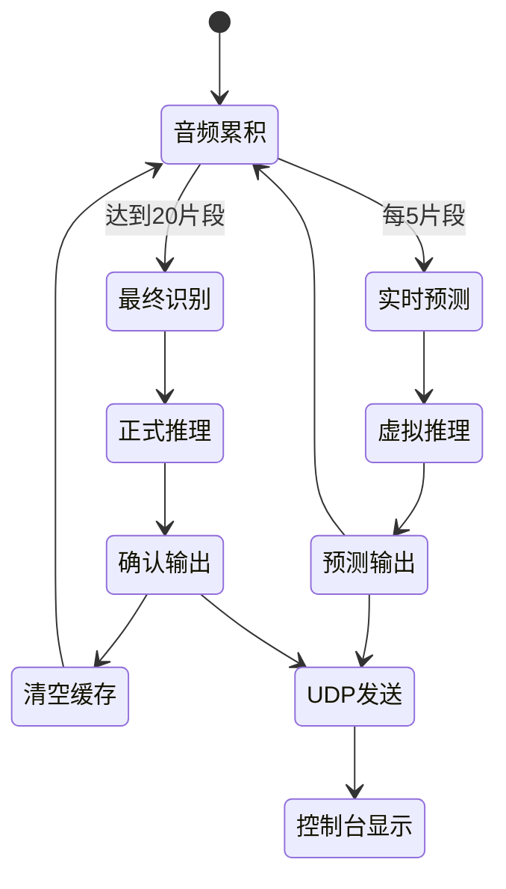
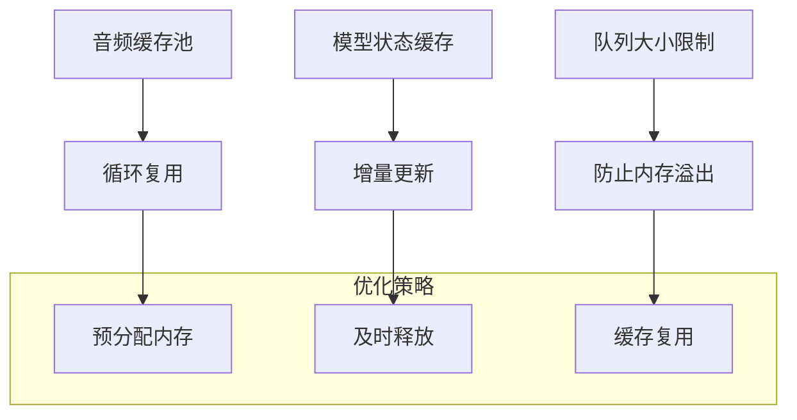
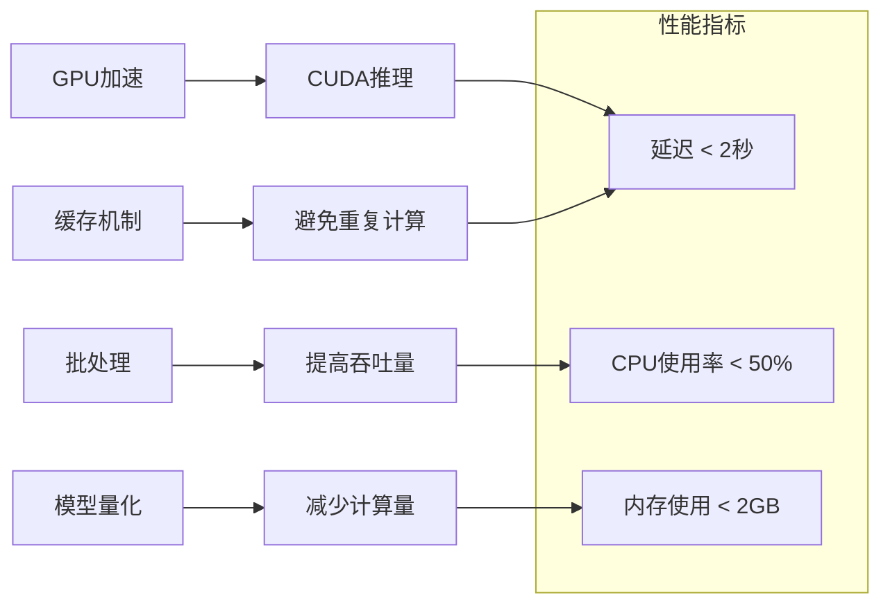
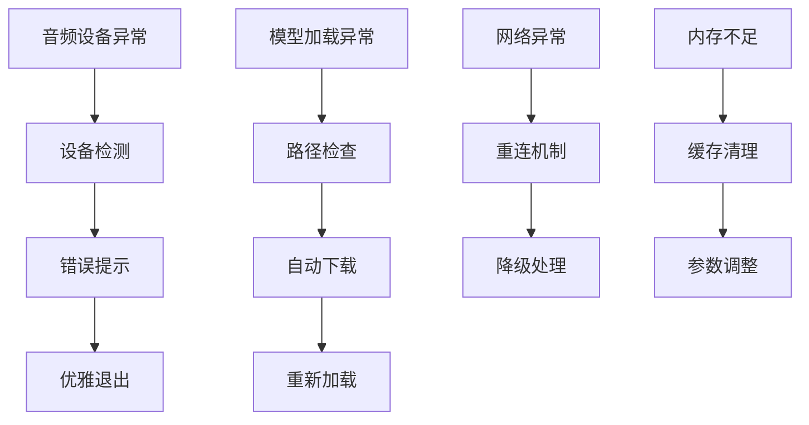

# 流式语音识别技术文档

## 概述

流式语音识别模块 (`streaming_asr.py`) 是项目的核心组件，实现了基于 SenseVoiceSmall 模型的实时语音转文字功能。该模块采用多进程架构，确保音频录制和模型推理的并行处理，实现低延迟的实时转录。

## 技术架构

### 整体架构图



### 核心组件

#### 1. 模型初始化
```python
# 模型配置
model = AutoModel(
    model=asr_model_path,           # SenseVoiceSmall 主模型
    vad_model=vad_model_path,       # 语音活动检测模型
    punc_model=punc_model_path,     # 标点符号预测模型
    ngpu=1,                         # GPU 数量
    device="cuda",                  # 计算设备
    disable_pbar=True,              # 禁用进度条
    disable_log=True,               # 禁用日志
    disable_update=True             # 禁用更新检查
)
```

#### 2. 多进程架构


## 核心算法

### 1. 音频处理流程



### 2. 滑动窗口机制



### 3. 双模式识别策略



## 关键代码解析

### 1. 音频录制回调函数

```python
def record_callback(indata: np.ndarray, 
                    frames: int, time_info, 
                    status: sd.CallbackFlags) -> None:
    """
    音频录制回调函数
    - 将48kHz音频降采样到16kHz
    - 转换为单声道
    - 放入处理队列
    """
    # 降采样：48kHz -> 16kHz (每3个采样点取1个)
    data = np.mean(indata.copy()[::3], axis=1)
    
    # 放入队列供识别进程处理
    queue_in.put({'type':'feed', 'samples':data})
    
    # 同时保存到文件
    f.writeframes((data * (2**15-1)).astype(np.int16).tobytes())
```

### 2. 识别处理核心逻辑

```python
def recognize(queue_in: Queue, queue_out: Queue):
    """
    识别进程主函数
    - 处理音频队列
    - 执行模型推理
    - 输出识别结果
    """
    chunk_size = [10, 20, 10]  # 滑动窗口配置
    chunks = []                # 音频片段缓存
    param_dict = {'cache': dict()}  # 模型状态缓存
    
    while instruction := queue_in.get():
        match instruction['type']:
            case 'feed':
                chunks.append(instruction['samples'])
                
                # 实时预测模式
                if len(chunks) < chunk_size[1] and pre_num == pre_expect:
                    虚字典 = deepcopy(param_dict)
                    虚字典['is_final'] = True
                    data = np.concatenate(chunks)
                    rec_result = model.generate(input=data, cache=虚字典.get('cache', {}))
                    # 输出预测结果...
                
                # 最终识别模式
                if len(chunks) == chunk_size[1]:
                    data = np.concatenate(chunks)
                    rec_result = model.generate(input=data, cache=param_dict.get('cache', {}))
                    # 输出确认结果...
                    chunks.clear()
```

## 性能优化

### 1. 内存管理



### 2. 计算优化



## 配置参数

### 模型配置
```python
# 模型路径配置
asr_model_path = "SenseVoiceSmall模型路径"
vad_model_path = "VAD模型路径"  
punc_model_path = "标点模型路径"

# 硬件配置
ngpu = 1                    # GPU数量
device = "cuda"             # 计算设备
ncpu = 4                    # CPU核心数
```

### 音频配置
```python
# 录制参数
samplerate = 48000          # 原始采样率
channels = 1                # 声道数
blocksize = int(3 * 960)    # 缓冲区大小 (0.06秒)

# 处理参数
target_samplerate = 16000   # 目标采样率
chunk_duration = 60         # 片段时长(ms)
chunk_size = [10, 20, 10]   # 滑动窗口配置
```

### 网络配置
```python
udp_port = 6009             # UDP发送端口
line_width = 50             # 显示行宽度
```

## 错误处理

### 1. 异常处理机制



### 2. 信号处理
```python
def signal_handler(sig, frame):
    """处理Ctrl+C中断信号"""
    print("\n\033[31m收到中断信号 Ctrl+C，退出程序\033[0m")
    sys.exit(0)

signal.signal(signal.SIGINT, signal_handler)
```

## 使用示例

### 基本使用
```bash
# 启动流式识别
python streaming_asr.py

# 程序会自动：
# 1. 加载模型
# 2. 初始化音频设备  
# 3. 开始实时录制和识别
# 4. 按回车键结束当前句子
```

### 高级配置
```python
# 自定义模型路径
home_directory = "自定义模型目录"
asr_model_path = os.path.join(home_directory, "模型名称")

# 自定义网络端口
udp_port = 8080

# 自定义显示参数
line_width = 80
```

## 性能监控

### 关键指标
- **延迟**: 音频输入到文本输出的时间差
- **准确率**: 识别文本的正确率
- **资源使用**: CPU、内存、GPU使用情况
- **网络状态**: UDP发送成功率

### 监控方法
```python
# 延迟监控
start_time = time.time()
# ... 处理逻辑 ...
latency = time.time() - start_time

# 资源监控
import psutil
cpu_percent = psutil.cpu_percent()
memory_percent = psutil.virtual_memory().percent
```

---

**文档版本**: v1.0  
**创建日期**: 2024-01-15  
**维护者**: 技术团队
