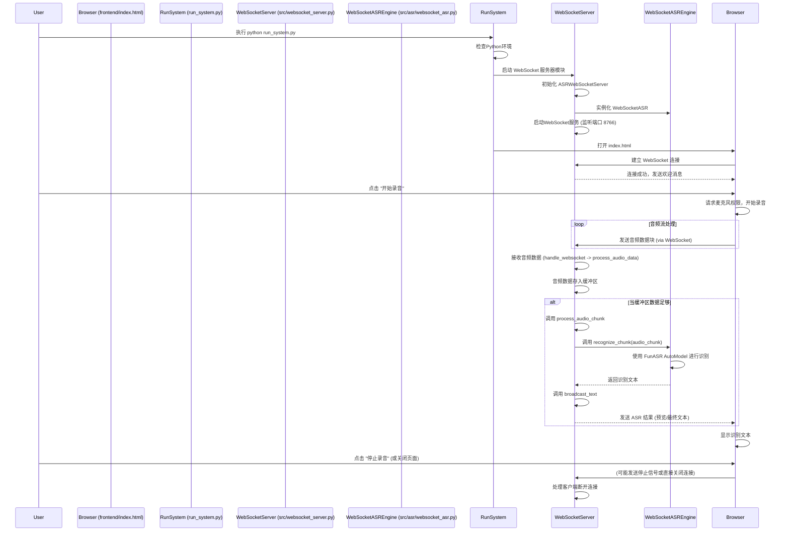
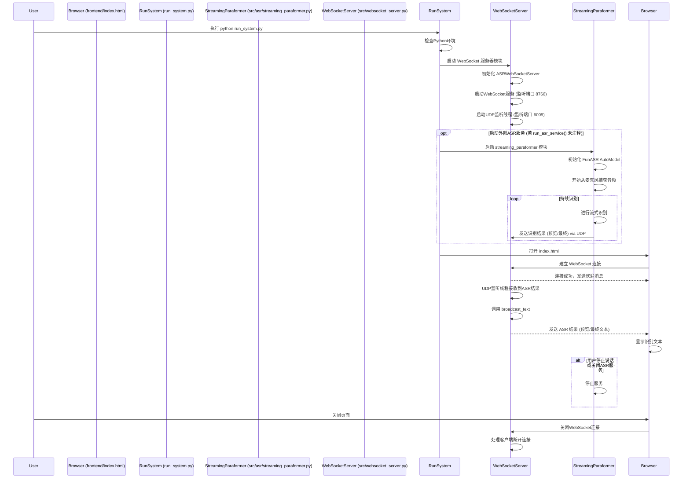

# FunASR 实时语音转文字系统 - 功能与流程

本文档描述了 FunASR 实时语音转文字系统的主要功能模块和代码执行流程。

## 主要功能模块

系统主要由以下几个模块组成：

1.  **系统启动脚本 (`run_system.py`)**
    *   负责检查 Python 虚拟环境的可用性。
    *   启动核心的 WebSocket 服务器。
    *   自动在浏览器中打开前端用户界面。

2.  **WebSocket 服务器 (`src/websocket_server.py`)**
    *   作为系统的核心通信枢纽。
    *   管理来自前端的 WebSocket 连接（默认端口 `8766`）。
    *   接收前端通过 WebSocket 发送的音频数据块。
    *   内置一个 `WebSocketASR` 引擎实例，用于处理接收到的音频数据并进行语音识别。
    *   将识别到的文本结果（预览和最终）通过 WebSocket 实时广播给所有连接的前端客户端。
    *   也保留了通过 UDP 端口（默认 `6009`）接收外部 ASR 服务数据的能力，但当前主要流程似乎更侧重于内置 ASR。

3.  **WebSocket ASR 引擎 (`src/asr/websocket_asr.py`)**
    *   被 `websocket_server.py` 实例化和调用。
    *   专门设计用于处理从 WebSocket 客户端（即前端）发送过来的音频流数据。
    *   使用 `funasr.AutoModel`（基于 Paraformer 模型）进行实时的语音识别。
    *   处理音频分块、调用模型进行识别，并返回文本结果。

4.  **外部流式 ASR 服务 (`src/asr/streaming_paraformer.py`)**
    *   这是一个独立的脚本，可以从系统麦克风捕获音频。
    *   同样使用 `funasr.AutoModel` 进行流式语音识别。
    *   将识别的预览文本和最终文本通过 UDP 协议发送到指定端口（默认为 `websocket_server.py` 监听的 UDP 端口）。
    *   提供了多种预设配置（如 `meeting`, `realtime`）以适应不同场景的识别需求。
    *   在当前 `run_system.py` 的默认配置下，此模块可能不是主要运行的 ASR 服务，但代码依然存在。

5.  **前端用户界面 (`frontend/index.html` 和 `frontend/style.css`)**
    *   提供用户交互界面，在浏览器中运行。
    *   通过 WebSocket 连接到后端的 `websocket_server.py`。
    *   实时接收并显示由服务器广播的 ASR 识别结果（包括预览文本和最终确认文本）。
    *   **核心功能**：允许用户通过浏览器麦克风进行录音，并将捕获的音频数据块实时发送到 WebSocket 服务器进行识别。
    *   提供诸如连接状态显示、清空文本、保存文本、重新连接服务器等辅助功能。
    *   支持键盘快捷键操作，提升用户体验。

## 代码执行流程 (基于前端录音和内置WebSocket ASR)

以下流程图描述了当用户使用前端进行录音，并通过内置于 WebSocket 服务器的 ASR 引擎进行识别时的主要步骤：

## 代码执行流程 (基于外部 `streaming_paraformer.py` 和 UDP 通信 - 备用流程)

如果系统配置为使用外部的 `streaming_paraformer.py` 进行麦克风输入和识别，并通过 UDP 将结果发送给 WebSocket 服务器，流程如下：

## 关键文件和目录结构

*   `.gitignore`: Git忽略文件配置。
*   `assets/`: 存放图标、示例图片等静态资源。
*   `audio/`: 可能用于存放示例输入/输出音频文件。
*   `docs/`: 项目文档，如此文档。
*   `frontend/`: 前端HTML和CSS文件。
    *   `index.html`: 用户界面。
    *   `style.css`: 界面样式。
*   `output/`: 可能用于存放ASR输出的文本文件等。
*   `poetry.lock`, `pyproject.toml`: Poetry依赖管理文件。
*   `requirements.txt`: Python依赖列表 (可能是Poetry导出或手动维护)。
*   `run_system.py`: 系统主启动脚本。
*   `scripts/`: 辅助脚本，如配置切换脚本。
*   `src/`: 项目核心源代码。
    *   `__init__.py`: 包初始化文件。
    *   `asr/`: ASR相关模块。
        *   `streaming_paraformer.py`: 独立的流式ASR识别服务 (麦克风输入, UDP输出)。
        *   `websocket_asr.py`: 内置于WebSocket服务器的ASR引擎 (WebSocket音频输入)。
    *   `config/`: 配置文件和配置切换逻辑。
        *   `asr_config.py`: ASR模型和行为的详细配置。
        *   `config_switcher.py`: 可能用于切换不同ASR配置的逻辑。
    *   `diarization_demo.py`: (未在主流程分析) 可能是一个声纹分离的演示脚本。
    *   `websocket_server.py`: 核心WebSocket服务器，处理客户端连接和数据转发/处理。

## 配置说明

ASR的行为和性能可以通过 `src/config/asr_config.py` 中的配置进行调整。该文件定义了不同场景（如 `meeting`, `realtime`）下的VAD（语音活动检测）参数、模型 `chunk_size`、预测间隔等，以优化识别效果和实时性。

`scripts/switch_config.py` 脚本可能用于在不同的预设配置之间进行切换。