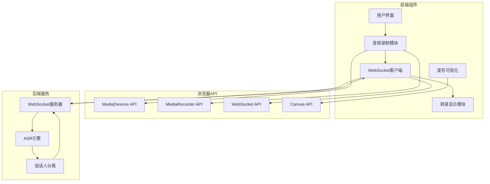
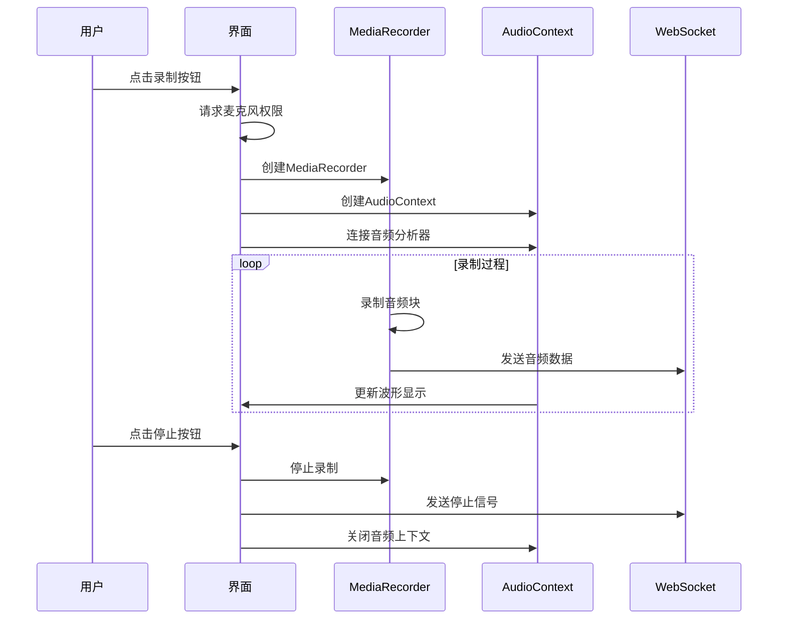
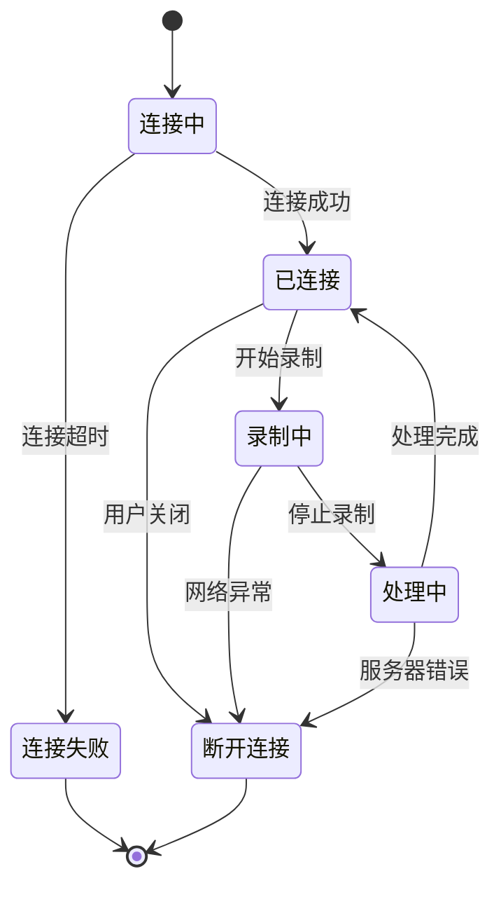
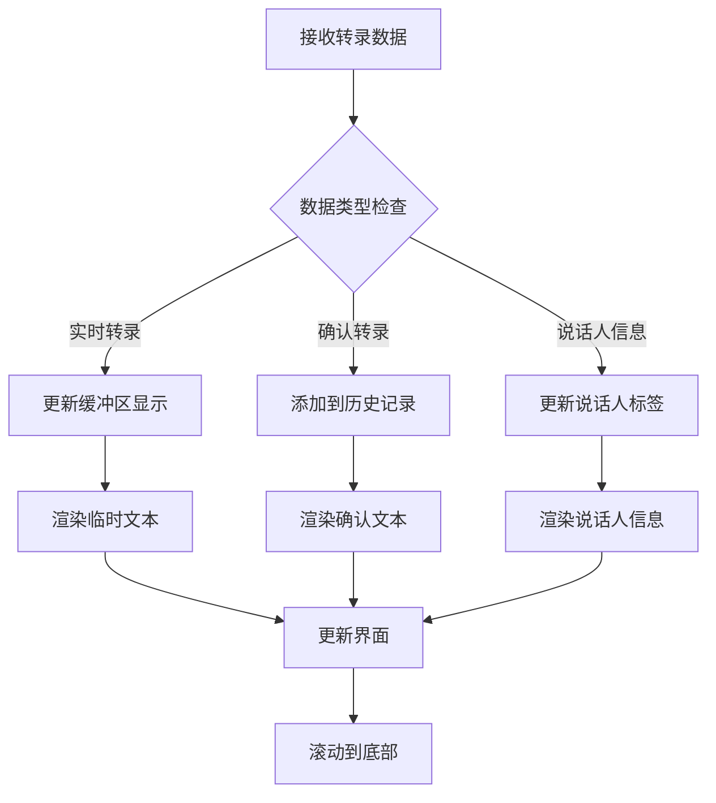
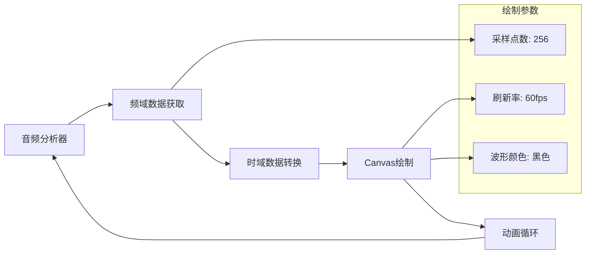
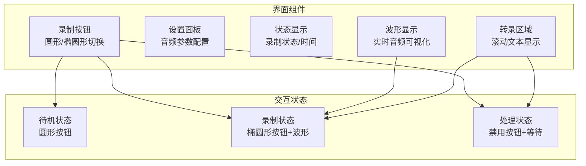
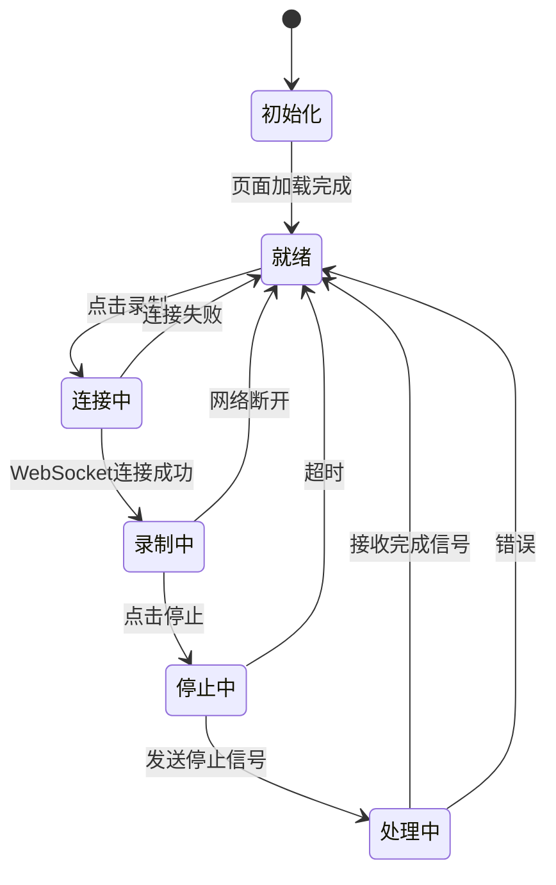
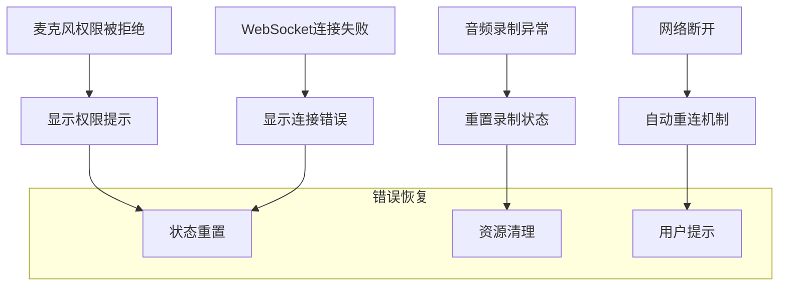

# Web界面技术文档

## 概述

Web界面模块 (`live_transcription.html`) 提供了基于浏览器的实时语音转录功能。该模块使用现代Web技术，通过WebSocket与后端服务通信，实现音频录制、实时转录显示、说话人分离等功能。

## 技术架构

### 整体架构图



### 核心技术栈

- **前端框架**: 原生JavaScript (ES6+)
- **音频处理**: Web Audio API, MediaRecorder API
- **实时通信**: WebSocket
- **可视化**: Canvas 2D API
- **样式**: CSS3 (Flexbox, Animations)

## 功能模块详解

### 1. 音频录制模块



#### 关键代码实现

```javascript
async function startRecording() {
    try {
        // 获取麦克风权限
        const stream = await navigator.mediaDevices.getUserMedia({ audio: true });
        
        // 创建音频上下文用于波形显示
        audioContext = new (window.AudioContext || window.webkitAudioContext)();
        analyser = audioContext.createAnalyser();
        analyser.fftSize = 256;
        microphone = audioContext.createMediaStreamSource(stream);
        microphone.connect(analyser);
        
        // 创建录制器
        recorder = new MediaRecorder(stream, { mimeType: "audio/webm" });
        recorder.ondataavailable = (e) => {
            if (websocket && websocket.readyState === WebSocket.OPEN) {
                websocket.send(e.data);  // 发送音频数据到服务器
            }
        };
        
        recorder.start(chunkDuration);  // 开始录制，按块发送
        drawWaveform();  // 开始波形绘制
        
    } catch (err) {
        console.error("录制启动失败:", err);
    }
}
```

### 2. WebSocket通信模块



#### WebSocket消息协议

```javascript
// 发送音频数据
websocket.send(audioBlob);

// 接收转录结果
websocket.onmessage = (event) => {
    const data = JSON.parse(event.data);
    
    switch(data.type) {
        case "transcription":
            // 处理转录结果
            updateTranscription(data);
            break;
            
        case "ready_to_stop":
            // 处理停止确认
            finalizeTranscription();
            break;
            
        case "error":
            // 处理错误信息
            handleError(data.message);
            break;
    }
};
```

### 3. 实时转录显示模块



#### 转录结果渲染

```javascript
function renderLinesWithBuffer(lines, buffer_diarization, buffer_transcription, 
                              remaining_time_diarization, remaining_time_transcription, 
                              isFinalizing = false, current_status = "active_transcription") {
    
    // 检查音频状态
    if (current_status === "no_audio_detected") {
        linesTranscriptDiv.innerHTML = "<p style='text-align: center; color: #666;'><em>No audio detected...</em></p>";
        return; 
    }

    // 渲染历史转录行
    const linesHtml = lines.map((item, idx) => {
        let timeInfo = "";
        if (item.beg !== undefined && item.end !== undefined) {
            timeInfo = ` ${item.beg} - ${item.end}`;
        }
        
        const speakerLabel = item.spk !== undefined 
            ? `<strong>说话人 ${item.spk}</strong>${timeInfo}` 
            : "";
            
        let currentLineText = item.text || "";
        
        // 添加缓冲区内容
        if (idx === lines.length - 1) {
            if (buffer_diarization && !isFinalizing) {
                currentLineText += `<span class="buffer_diarization">${buffer_diarization}</span>`;
            }
            if (buffer_transcription) {
                if (isFinalizing) {
                    currentLineText += (currentLineText.length > 0 ? " " : "") + buffer_transcription.trim();
                } else {
                    currentLineText += `<span class="buffer_transcription">${buffer_transcription}</span>`;
                }
            }
        }
        
        return `<p>${speakerLabel}<br/><div class='textcontent'>${currentLineText}</div></p>`;
    }).join("");

    linesTranscriptDiv.innerHTML = linesHtml;
}
```

### 4. 波形可视化模块



#### 波形绘制实现

```javascript
function drawWaveform() {
    if (!analyser) return;
    
    const bufferLength = analyser.frequencyBinCount;
    const dataArray = new Uint8Array(bufferLength);
    analyser.getByteTimeDomainData(dataArray);
    
    // 清空画布
    waveCtx.clearRect(0, 0, waveCanvas.width / (window.devicePixelRatio || 1), 
                             waveCanvas.height / (window.devicePixelRatio || 1));
    
    // 设置绘制样式
    waveCtx.lineWidth = 1;
    waveCtx.strokeStyle = 'rgb(0, 0, 0)';
    waveCtx.beginPath();
    
    const sliceWidth = (waveCanvas.width / (window.devicePixelRatio || 1)) / bufferLength;
    let x = 0;
    
    // 绘制波形
    for (let i = 0; i < bufferLength; i++) {
        const v = dataArray[i] / 128.0;
        const y = v * (waveCanvas.height / (window.devicePixelRatio || 1)) / 2;
        
        if (i === 0) {
            waveCtx.moveTo(x, y);
        } else {
            waveCtx.lineTo(x, y);
        }
        
        x += sliceWidth;
    }
    
    waveCtx.stroke();
    animationFrame = requestAnimationFrame(drawWaveform);
}
```

## 用户界面设计

### 1. 响应式布局



### 2. 样式系统

```css
/* 录制按钮样式 */
#recordButton {
    width: 50px;
    height: 50px;
    border: none;
    border-radius: 50%;
    background-color: white;
    cursor: pointer;
    transition: all 0.3s ease;
}

#recordButton.recording {
    width: 180px;
    border-radius: 40px;
    justify-content: flex-start;
    padding-left: 20px;
}

/* 转录文本样式 */
.buffer_transcription {
    color: #666;
    font-style: italic;
}

.buffer_diarization {
    color: #999;
    font-size: 0.9em;
}

.textcontent {
    margin-top: 5px;
    line-height: 1.4;
}
```

## 状态管理

### 1. 应用状态机



### 2. 状态变量管理

```javascript
// 全局状态变量
let isRecording = false;           // 录制状态
let websocket = null;              // WebSocket连接
let recorder = null;               // 媒体录制器
let waitingForStop = false;        // 等待停止状态
let audioContext = null;           // 音频上下文
let analyser = null;               // 音频分析器

// 配置变量
let chunkDuration = 1000;          // 音频块时长(ms)
let websocketUrl = "ws://localhost:8000/asr";  // WebSocket地址

// UI更新函数
function updateUI() {
    recordButton.classList.toggle("recording", isRecording);
    recordButton.disabled = waitingForStop;
    
    if (waitingForStop) {
        statusText.textContent = "Please wait for processing to complete...";
    } else if (isRecording) {
        statusText.textContent = "Recording...";
    } else {
        statusText.textContent = "Click to start transcription";
    }
}
```

## 错误处理

### 1. 异常处理策略



### 2. 错误处理实现

```javascript
// WebSocket错误处理
websocket.onerror = (error) => {
    console.error("WebSocket错误:", error);
    statusText.textContent = "Connection error. Please try again.";
    if (isRecording) {
        stopRecording();
    }
};

// 麦克风权限错误处理
try {
    const stream = await navigator.mediaDevices.getUserMedia({ audio: true });
} catch (err) {
    if (err.name === 'NotAllowedError') {
        statusText.textContent = "Microphone access denied. Please allow microphone access.";
    } else if (err.name === 'NotFoundError') {
        statusText.textContent = "No microphone found. Please connect a microphone.";
    } else {
        statusText.textContent = "Error accessing microphone: " + err.message;
    }
}
```

## 性能优化

### 1. 内存管理

```javascript
// 资源清理函数
function cleanupResources() {
    if (recorder) {
        recorder.stop();
        recorder = null;
    }
    
    if (microphone) {
        microphone.disconnect();
        microphone = null;
    }
    
    if (audioContext && audioContext.state !== 'closed') {
        audioContext.close();
        audioContext = null;
    }
    
    if (animationFrame) {
        cancelAnimationFrame(animationFrame);
        animationFrame = null;
    }
}
```

### 2. 性能监控

```javascript
// 性能指标监控
const performanceMetrics = {
    startTime: null,
    audioChunks: 0,
    totalLatency: 0,
    
    recordStart() {
        this.startTime = performance.now();
        this.audioChunks = 0;
        this.totalLatency = 0;
    },
    
    recordChunk() {
        this.audioChunks++;
    },
    
    recordLatency(latency) {
        this.totalLatency += latency;
    },
    
    getAverageLatency() {
        return this.audioChunks > 0 ? this.totalLatency / this.audioChunks : 0;
    }
};
```

## 部署配置

### 1. 服务器配置

```javascript
// WebSocket服务器地址配置
const host = window.location.hostname || "localhost";
const port = window.location.port || "8000";
const protocol = window.location.protocol === "https:" ? "wss" : "ws";
const defaultWebSocketUrl = `${protocol}://${host}:${port}/asr`;
```

### 2. 浏览器兼容性

```javascript
// 浏览器API兼容性检查
function checkBrowserSupport() {
    const support = {
        mediaDevices: !!navigator.mediaDevices,
        mediaRecorder: !!window.MediaRecorder,
        webSocket: !!window.WebSocket,
        audioContext: !!(window.AudioContext || window.webkitAudioContext)
    };
    
    const unsupported = Object.keys(support).filter(key => !support[key]);
    
    if (unsupported.length > 0) {
        console.warn("不支持的浏览器功能:", unsupported);
        return false;
    }
    
    return true;
}
```

---

**文档版本**: v1.0  
**创建日期**: 2024-01-15  
**维护者**: 技术团队
