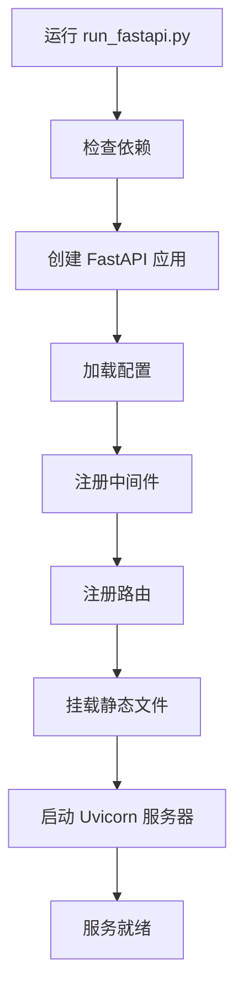
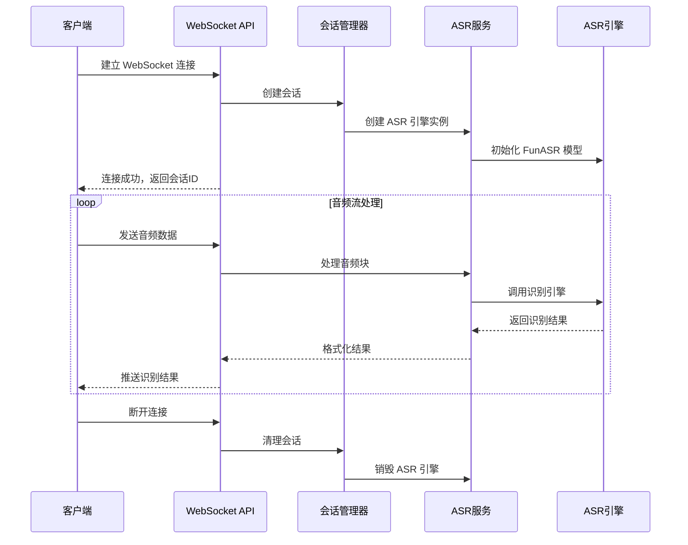
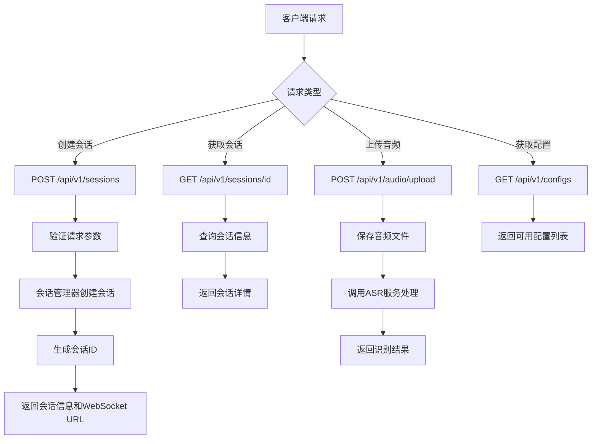
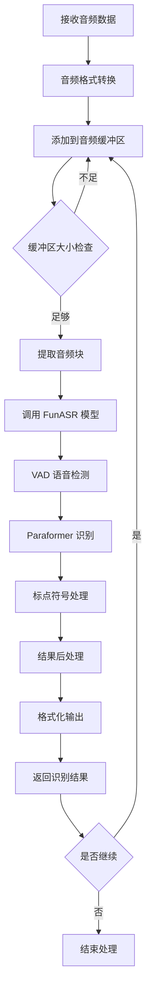
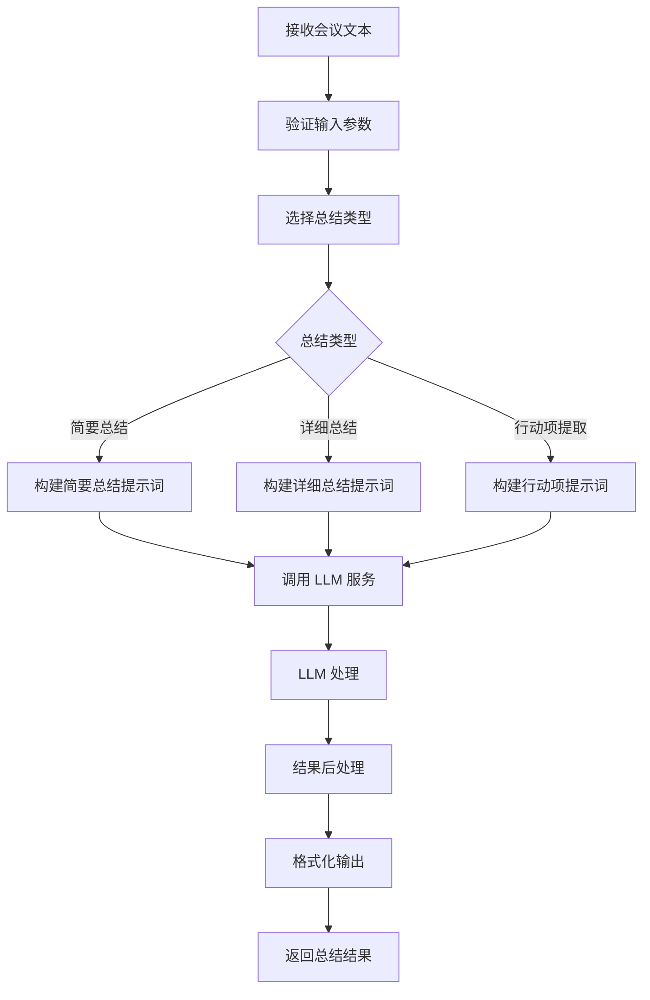
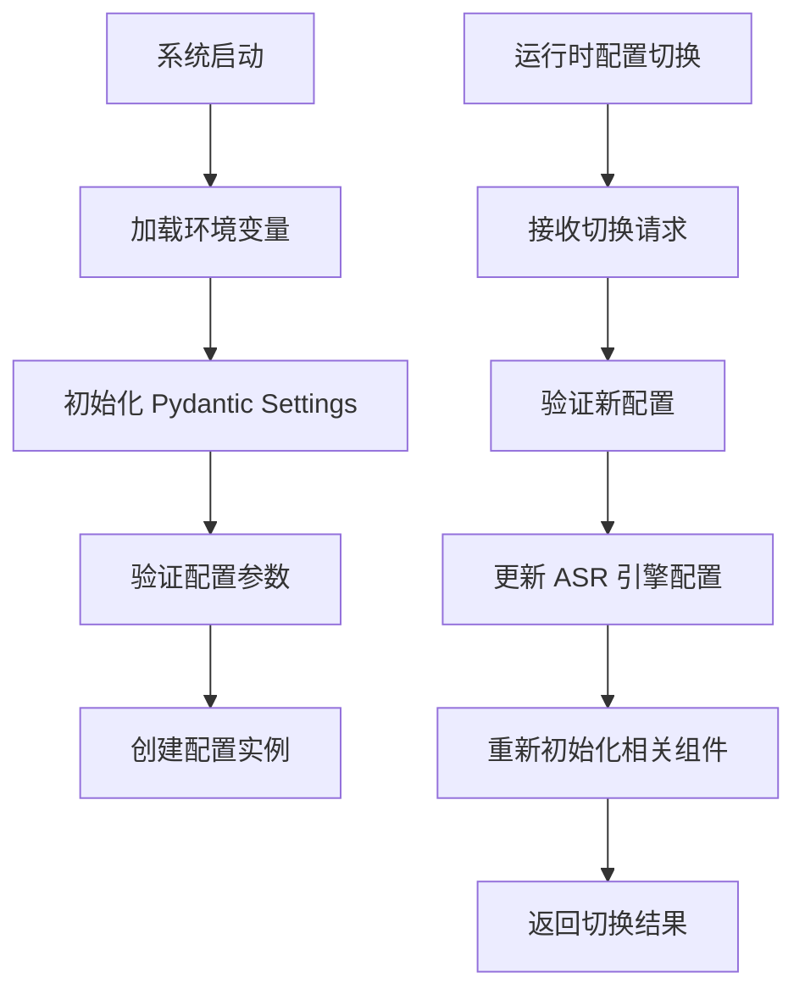
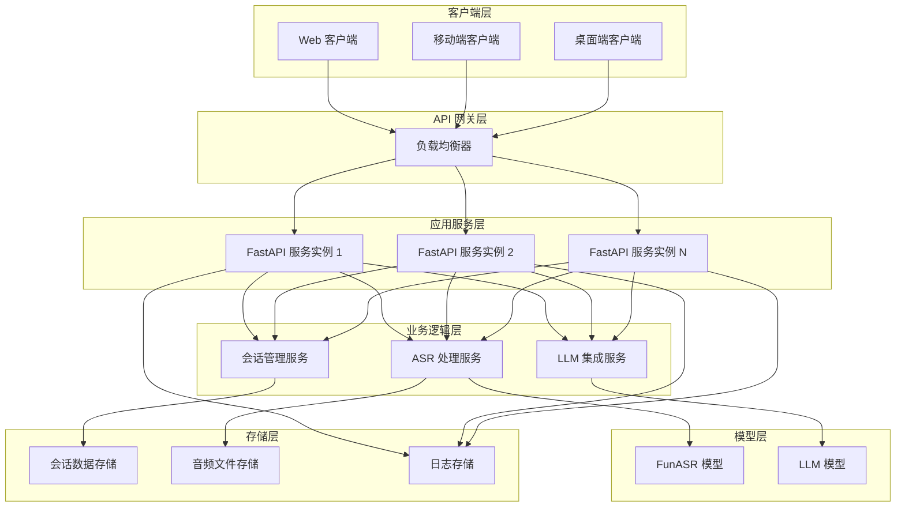

# ASR Service 项目功能模块与代码执行流程

## 项目概述

ASR Service 是一个基于 FastAPI 和 FunASR 的现代化实时语音识别服务，提供 WebSocket 和 REST API 双协议支持，具备多客户端接入能力和完整的会话管理功能。

## 主要功能模块

### 1. 核心服务模块

#### 1.1 FastAPI 应用核心 (`app/main.py`)
- **功能**: 应用入口点，路由注册，中间件配置
- **职责**: 
  - 创建 FastAPI 应用实例
  - 配置 CORS 中间件
  - 注册各模块路由
  - 提供静态文件服务
  - 请求日志记录

#### 1.2 配置管理 (`app/core/config.py`)
- **功能**: 基于 Pydantic 的配置系统
- **职责**:
  - 环境变量管理
  - 服务配置（端口、地址等）
  - ASR 模型路径配置
  - WebSocket 配置

### 2. API 接口模块

#### 2.1 WebSocket API (`app/api/websocket.py`)
- **功能**: 实时音频流处理
- **职责**:
  - WebSocket 连接管理
  - 实时音频数据接收
  - 音频识别结果推送
  - 连接状态管理

#### 2.2 REST API (`app/api/rest.py`)
- **功能**: HTTP 接口服务
- **职责**:
  - 会话管理接口
  - 配置管理接口
  - 音频文件上传处理
  - 健康检查接口

#### 2.3 LLM API (`app/api/llm_routes.py`)
- **功能**: 大语言模型集成
- **职责**:
  - LLM 提供商管理
  - 文本处理请求
  - 流式响应支持

#### 2.4 会议总结 API (`app/api/meeting_summary.py`)
- **功能**: 会议记录智能总结
- **职责**:
  - 会议文本总结
  - 多种总结类型支持
  - 行动项提取

### 3. 业务服务模块

#### 3.1 ASR 服务 (`app/services/asr_service.py`)
- **功能**: 语音识别服务封装
- **职责**:
  - ASR 引擎管理
  - 音频数据处理
  - 识别结果格式化
  - 多配置支持

#### 3.2 会话管理 (`app/services/session_manager.py`)
- **功能**: 会话生命周期管理
- **职责**:
  - 会话创建和销毁
  - 会话状态跟踪
  - 客户端会话映射
  - 过期会话清理

### 4. ASR 引擎模块

#### 4.1 WebSocket ASR (`src/asr/websocket_asr.py`)
- **功能**: 专门处理 WebSocket 音频流的 ASR 引擎
- **职责**:
  - FunASR 模型集成
  - 音频缓冲管理
  - 实时识别处理
  - 结果优化

#### 4.2 ASR 配置 (`src/config/asr_config.py`)
- **功能**: ASR 引擎配置管理
- **职责**:
  - VAD 参数配置
  - 不同场景配置
  - 识别精度优化

### 5. 数据模型模块

#### 5.1 Pydantic 模型 (`app/models/schemas.py`)
- **功能**: API 数据结构定义
- **职责**:
  - 请求响应模型
  - 数据验证
  - 类型安全

### 6. LLM 集成模块

#### 6.1 LLM 管理器 (`app/llm/`)
- **功能**: 大语言模型集成框架
- **职责**:
  - 多提供商支持
  - 统一接口封装
  - 错误处理

## 代码执行流程

### 1. 系统启动流程

### 2. WebSocket 实时识别流程

### 3. REST API 会话管理流程

### 4. ASR 音频处理流程

### 5. 会议总结处理流程

### 6. 配置管理流程

## 关键技术特性

### 1. 异步处理
- 基于 FastAPI 的异步框架
- WebSocket 异步连接管理
- 异步音频处理流水线

### 2. 模块化设计
- 清晰的模块边界
- 依赖注入模式
- 可扩展的插件架构

### 3. 配置管理
- 环境变量驱动
- 运行时配置热切换
- 多场景配置支持

### 4. 错误处理
- 统一异常处理
- 详细错误日志
- 优雅降级机制

### 5. 性能优化
- 音频缓冲管理
- 连接池复用
- 内存使用优化

## 部署架构

## 总结

本项目采用现代化的微服务架构设计，通过模块化的方式实现了完整的语音识别服务。主要特点包括：

1. **高性能**: 基于 FastAPI 的异步处理能力
2. **可扩展**: 清晰的模块划分和插件化设计
3. **易维护**: 统一的配置管理和错误处理
4. **多协议**: 同时支持 WebSocket 和 REST API
5. **智能化**: 集成 LLM 提供智能总结功能

通过合理的架构设计和代码组织，项目具备了良好的可维护性和扩展性，能够满足不同场景下的语音识别需求。