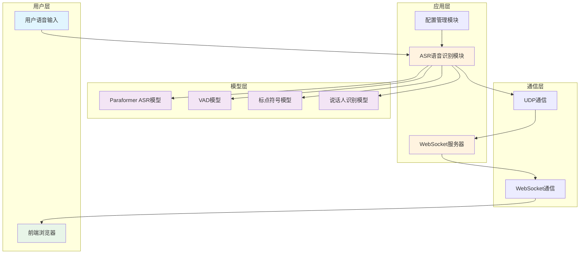
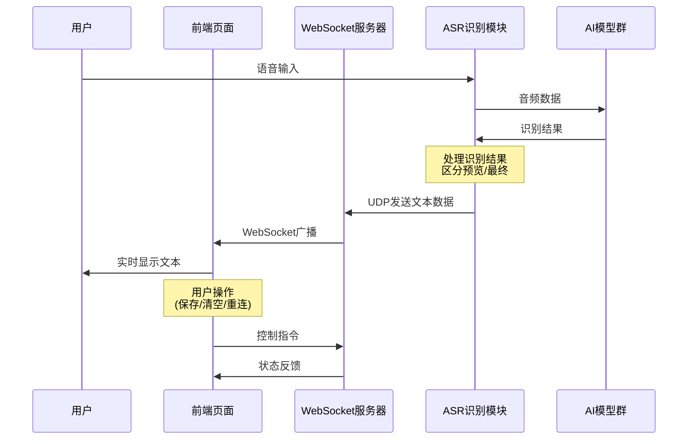
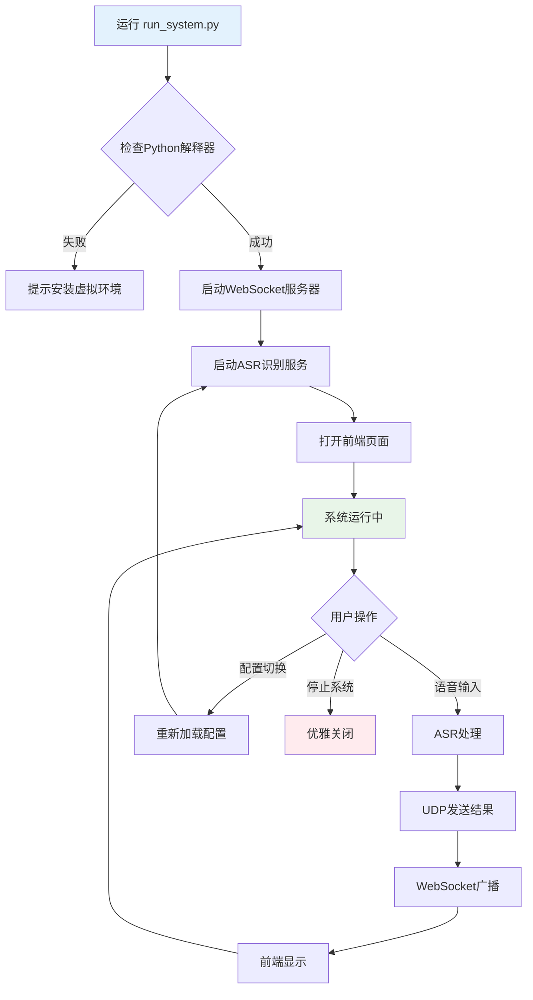
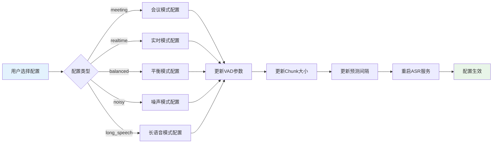
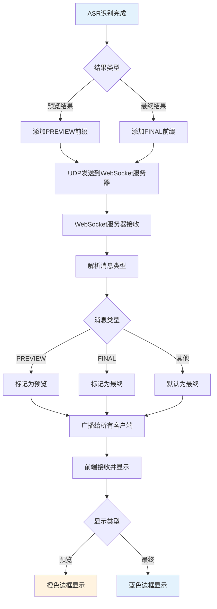
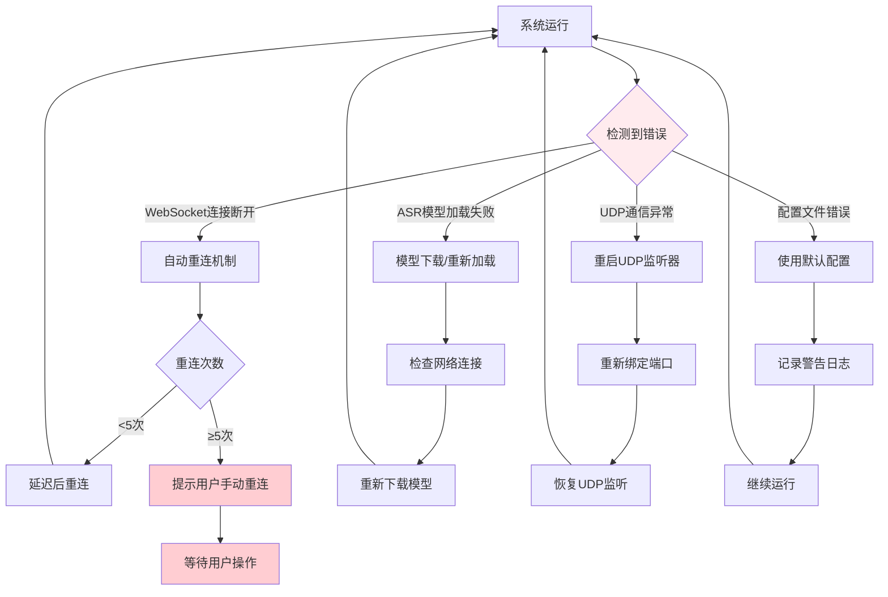

# FunASR-Online-Paraformer-Test 项目架构与流程文档

## 项目概述

本项目是一个基于 FunASR Paraformer 模型的实时语音转文字系统，采用 WebSocket 通信架构，提供实时语音识别和文本显示功能。

## 主要功能模块

### 1. 语音识别模块 (ASR Module)
**文件位置**: `src/asr/streaming_paraformer.py`

**核心功能**:
- 实时音频采集和处理
- 基于 FunASR Paraformer 模型的语音识别
- 支持 VAD (Voice Activity Detection) 语音活动检测
- 支持标点符号预测和说话人识别
- 通过 UDP 协议发送识别结果

**关键特性**:
- 流式处理，支持实时识别
- 可配置的 chunk_size 和预测间隔
- 智能句子分割，避免错误拆分
- 支持预览和最终结果两种输出模式

### 2. WebSocket 服务器模块
**文件位置**: `src/websocket_server.py`

**核心功能**:
- 接收 ASR 模块通过 UDP 发送的识别结果
- 通过 WebSocket 协议向前端客户端广播文本数据
- 管理多个客户端连接
- 提供连接状态监控和自动重连机制

**关键特性**:
- 异步处理，支持多客户端并发
- 消息类型区分（预览/最终结果）
- 客户端连接管理和异常处理
- 实时状态广播

### 3. 配置管理模块
**文件位置**: `src/config/asr_config.py`, `src/config/config_switcher.py`

**核心功能**:
- 提供多种预设配置（会议、实时、平衡、噪声、长语音）
- 动态配置切换
- VAD 参数优化
- Chunk 大小和预测间隔配置

**可用配置类型**:
- `balanced`: 平衡精度和响应速度（默认）
- `meeting`: 会议转录，追求高精度
- `realtime`: 实时对话，追求快速响应
- `noisy`: 噪声环境，提高噪声容忍度
- `long_speech`: 长语音，适用于演讲等场景

### 4. 前端显示模块
**文件位置**: `frontend/index.html`, `frontend/style.css`

**核心功能**:
- 实时显示语音识别结果
- 区分预览文本和最终文本
- 提供文本保存、清空、重连等操作
- 连接状态指示和错误处理

**用户界面特性**:
- 响应式设计，支持桌面和移动设备
- 现代化 UI 设计
- 快捷键支持（Ctrl+L 清空，Ctrl+S 保存，Ctrl+R 重连）
- 实时状态指示器

### 5. 系统启动模块
**文件位置**: `run_system.py`, `src/system_launcher.py`

**核心功能**:
- 一键启动整个系统
- 依赖检查和自动安装
- 多进程管理
- 自动打开前端页面

## 系统架构图

## 数据流程图

## 系统启动流程

## 配置切换流程

## 消息处理流程

## 错误处理流程

## 性能优化要点

### 1. ASR模块优化
- **Chunk大小调优**: 根据使用场景选择合适的chunk_size
- **预测间隔控制**: 平衡实时性和计算资源消耗
- **VAD参数优化**: 减少误触发和漏检
- **句子分割智能化**: 避免语义完整的句子被错误拆分

### 2. 通信优化
- **UDP缓冲区管理**: 避免数据丢失
- **WebSocket连接池**: 高效管理多客户端连接
- **消息压缩**: 减少网络传输开销
- **异步处理**: 提高并发处理能力

### 3. 前端优化
- **DOM更新优化**: 减少不必要的重绘
- **内存管理**: 及时清理长文本缓存
- **响应式设计**: 适配不同设备和屏幕尺寸

## 部署建议

### 1. 硬件要求
- **CPU**: 4核以上，支持AVX指令集
- **内存**: 8GB以上
- **GPU**: NVIDIA GPU（可选，用于加速推理）
- **存储**: 10GB以上可用空间（用于模型缓存）

### 2. 软件环境
- **Python**: 3.8+
- **CUDA**: 11.0+（如使用GPU）
- **操作系统**: Windows 10+, Linux, macOS

### 3. 网络配置
- **端口开放**: UDP 6009, WebSocket 8766
- **防火墙配置**: 允许本地通信
- **带宽要求**: 上行1Mbps以上

## 故障排除指南

### 常见问题及解决方案

1. **模型下载失败**
   - 检查网络连接
   - 配置代理设置
   - 手动下载模型文件

2. **WebSocket连接失败**
   - 检查端口占用情况
   - 确认防火墙设置
   - 重启WebSocket服务器

3. **识别效果不佳**
   - 调整麦克风设置
   - 切换适合的配置模式
   - 检查环境噪声

4. **系统性能问题**
   - 调整chunk_size参数
   - 关闭不必要的后台程序
   - 考虑使用GPU加速

## 扩展开发指南

### 1. 添加新的配置模式
1. 在 `src/config/asr_config.py` 中定义新配置
2. 更新 `get_config()` 函数
3. 在配置切换工具中添加新选项

### 2. 自定义前端界面
1. 修改 `frontend/style.css` 样式文件
2. 在 `frontend/index.html` 中添加新功能
3. 扩展WebSocket消息协议

### 3. 集成其他ASR模型
1. 创建新的ASR模块文件
2. 实现统一的接口规范
3. 更新配置管理系统

---

*本文档最后更新时间: 2024年12月*