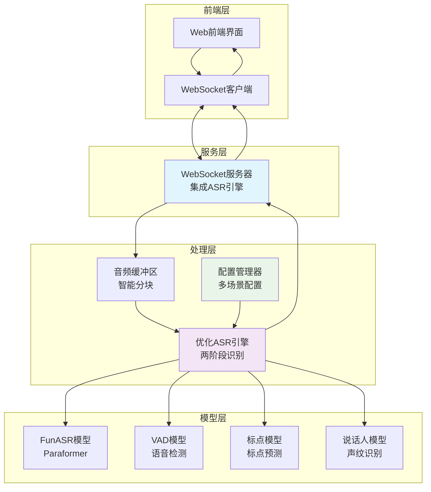
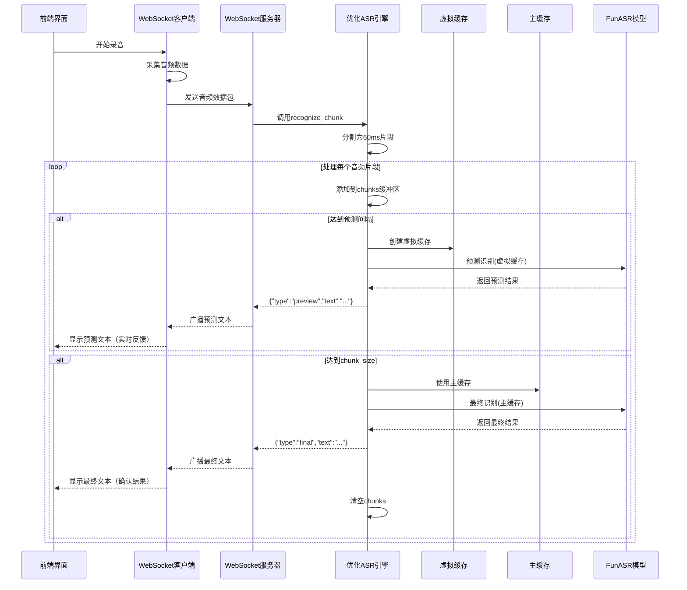
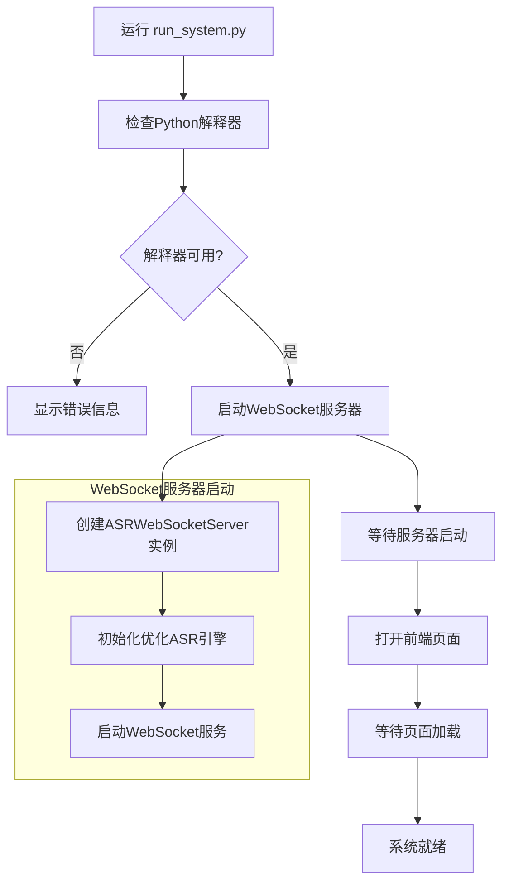
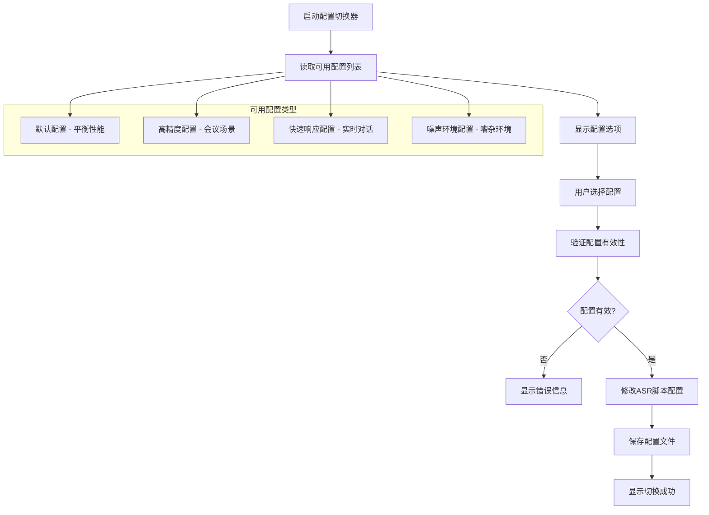

# FunASR-Online-Paraformer-Test 项目架构与流程说明

## 项目概述

本项目是一个基于FunASR的实时语音转文字系统，采用WebSocket架构实现前后端通信，支持实时语音识别和文本显示。

## 主要功能模块

### 1. 核心服务模块

#### 1.1 WebSocket服务器 (`src/websocket_server.py`)
- **功能**: 作为系统的核心通信枢纽
- **职责**:
  - 接收前端WebSocket连接
  - 处理来自前端的音频数据
  - 集成内置ASR引擎进行实时识别
  - 广播识别结果给所有连接的客户端
  - 管理客户端连接状态
- **关键特性**:
  - 支持多客户端连接
  - 音频缓冲区管理
  - 异步处理音频数据
  - 两阶段识别（预测+最终结果）
  - 简化的架构，无需UDP通信

#### 1.2 ASR引擎 (`src/asr/websocket_asr.py`) - 已优化
- **功能**: 语音识别核心引擎（参考streaming_paraformer.py优化）
- **职责**:
  - 初始化FunASR模型（Paraformer）
  - 处理音频块识别
  - 管理识别缓存（主缓存+虚拟缓存）
  - 优化识别效果
- **关键特性**:
  - 基于FunASR AutoModel
  - 支持VAD（语音活动检测）
  - 支持标点符号预测
  - 智能音频分块处理
  - 两阶段识别机制（预测+最终）
  - 配置文件驱动的参数优化
  - 句子边界智能检测

### 2. 配置管理模块

#### 2.1 ASR配置 (`src/config/asr_config.py`)
- **功能**: 语音识别参数配置
- **包含配置**:
  - VAD模型参数（静音检测、噪声阈值等）
  - Chunk Size配置（音频分块参数）
  - 不同场景的预设配置（会议、快速响应、噪声环境等）

#### 2.2 配置切换器 (`src/config/config_switcher.py`)
- **功能**: 动态切换ASR配置
- **职责**:
  - 列出可用配置
  - 修改ASR脚本配置
  - 显示当前配置状态

### 3. 前端界面模块

#### 3.1 Web界面 (`frontend/index.html`)
- **功能**: 用户交互界面
- **特性**:
  - 实时文本显示
  - 连接状态指示
  - 录音控制
  - 文本保存功能
  - 响应式设计

#### 3.2 WebSocket客户端 (JavaScript)
- **功能**: 前端WebSocket通信
- **职责**:
  - 建立WebSocket连接
  - 发送音频数据
  - 接收识别结果
  - 处理连接重连

### 4. 系统启动模块

#### 4.1 系统启动器 (`run_system.py`)
- **功能**: 系统统一启动入口
- **职责**:
  - 检查Python环境
  - 启动WebSocket服务器
  - 打开前端页面
  - 协调各模块启动

#### 4.2 配置切换脚本 (`scripts/switch_config.py`)
- **功能**: 配置切换工具入口
- **职责**:
  - 提供命令行配置切换
  - 支持交互式配置选择

### 5. 扩展功能模块

#### 5.1 说话人分离 (`src/diarization_demo.py`)
- **功能**: 说话人识别和分离
- **特性**:
  - 基于GUI的音频处理
  - 支持多说话人识别
  - 音频文件处理

## 系统架构流程图

### 整体系统架构

### 音频处理流程（优化后）

### 系统启动流程

### 配置管理流程

## 关键技术特性

### 1. 优化的两阶段识别机制
- **预测阶段**:
  - 使用虚拟缓存进行快速预测
  - 智能预测间隔控制（可配置）
  - 避免在特定标点处分割
  - 提供实时反馈，不影响最终识别
- **最终阶段**:
  - 使用主缓存进行精确识别
  - 完整的上下文信息
  - 句子边界智能检测
  - 返回经过优化的最终识别结果

### 2. 智能音频缓冲管理
- 动态音频分块（60ms片段）
- 配置驱动的chunk_size参数
- 左右回看机制提升准确性
- 内存优化管理
- 错误累积防护

### 3. 多客户端支持
- WebSocket连接池管理
- 结构化消息广播
- 预测/最终结果区分
- 连接状态监控

### 4. 配置热切换
- 运行时配置切换
- 多场景预设配置：
  - `meeting`: 会议转录，高精度
  - `realtime`: 实时对话，快速响应
  - `balanced`: 平衡配置，默认推荐
  - `noisy`: 噪声环境优化
  - `long_speech`: 长语音处理
- VAD参数动态调整

### 5. 增强的容错机制
- 连接断开重连
- 错误恢复处理
- 缓冲区自动清理
- 模型加载失败处理
- 音频数据格式容错

### 6. 架构简化优势
- **移除UDP依赖**: 不再需要UDP监听，减少网络复杂性
- **直接集成**: ASR引擎直接集成到WebSocket服务器
- **减少延迟**: 消除UDP通信开销
- **提高安全性**: 减少网络端口暴露
- **简化部署**: 更少的网络配置需求

## 部署说明

### 环境要求
- Python 3.9+
- Poetry包管理器
- FunASR模型文件
- 现代Web浏览器（支持WebRTC）
- CUDA环境（推荐，用于GPU加速）

### 启动步骤
1. 安装依赖: `poetry install`
2. 运行系统: `python run_system.py`
3. 访问前端界面（自动打开）
4. 开始语音识别

### 配置调优
- 使用 `python scripts/switch_config.py` 切换配置
- 根据使用场景选择合适的配置：
  - **会议转录**: `meeting` 配置，追求高精度
  - **实时对话**: `realtime` 配置，追求快速响应
  - **一般场景**: `balanced` 配置，平衡精度和速度
  - **噪声环境**: `noisy` 配置，提高噪声容忍度
- 监控预测和最终结果的比例，必要时调整预测间隔

### 网络配置简化
优化后的系统只需要：
- WebSocket端口：8766（默认）
- 无需UDP端口配置
- 无需额外的网络监听器
- 减少防火墙配置需求

## 系统优化历程

### 优化前架构问题
1. **UDP通信复杂性**: 需要维护UDP监听器和WebSocket服务器两套通信机制
2. **ASR引擎效果**: `websocket_asr.py` 效果不如 `streaming_paraformer.py`
3. **配置利用不足**: 未充分利用配置文件中的优化参数
4. **识别机制单一**: 只有最终识别，缺乏实时预测反馈

### 优化后架构优势
1. **架构简化**:
   - 移除UDP监听器，直接集成ASR引擎
   - 减少网络通信层次
   - 降低系统复杂度
2. **识别效果提升**:
   - 参考 `streaming_paraformer.py` 的优秀实现
   - 实现两阶段识别机制
   - 智能音频分块和缓存管理
3. **配置驱动优化**:
   - 完全支持配置文件参数
   - 多场景预设配置
   - 动态参数调整
4. **用户体验改善**:
   - 实时预测反馈
   - 更准确的最终结果
   - 更快的响应速度

### 性能对比

| 特性 | 优化前 | 优化后 |
|------|--------|--------|
| 通信架构 | WebSocket + UDP | 纯WebSocket |
| 识别机制 | 单阶段 | 两阶段（预测+最终） |
| 音频分块 | 固定1秒 | 动态配置（60ms片段） |
| 缓存策略 | 简单缓存 | 主缓存+虚拟缓存 |
| 配置支持 | 部分支持 | 完全支持 |
| 实时性 | 一般 | 优秀 |
| 准确性 | 一般 | 优秀 |

## 扩展性

系统采用模块化设计，支持以下扩展：
- 新增识别语言支持
- 集成其他ASR引擎
- 添加语音增强功能
- 支持更多音频格式
- 集成云端ASR服务
- 添加更多预设配置场景
- 支持自定义识别参数